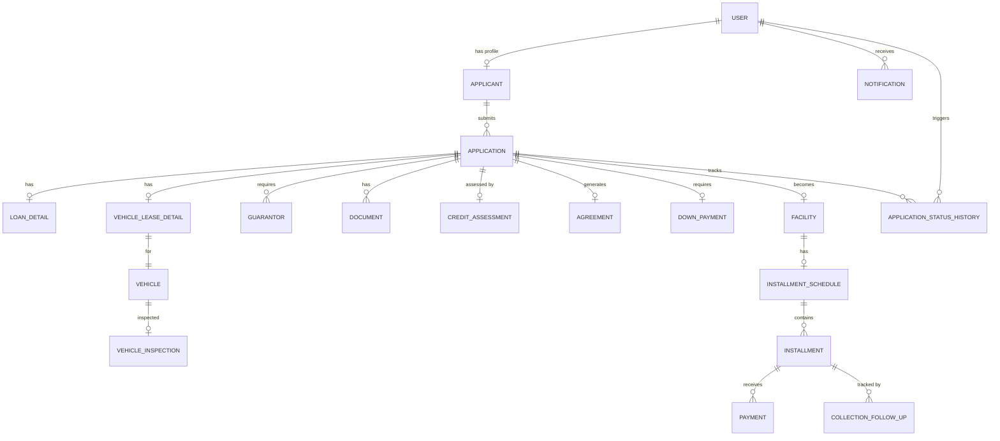
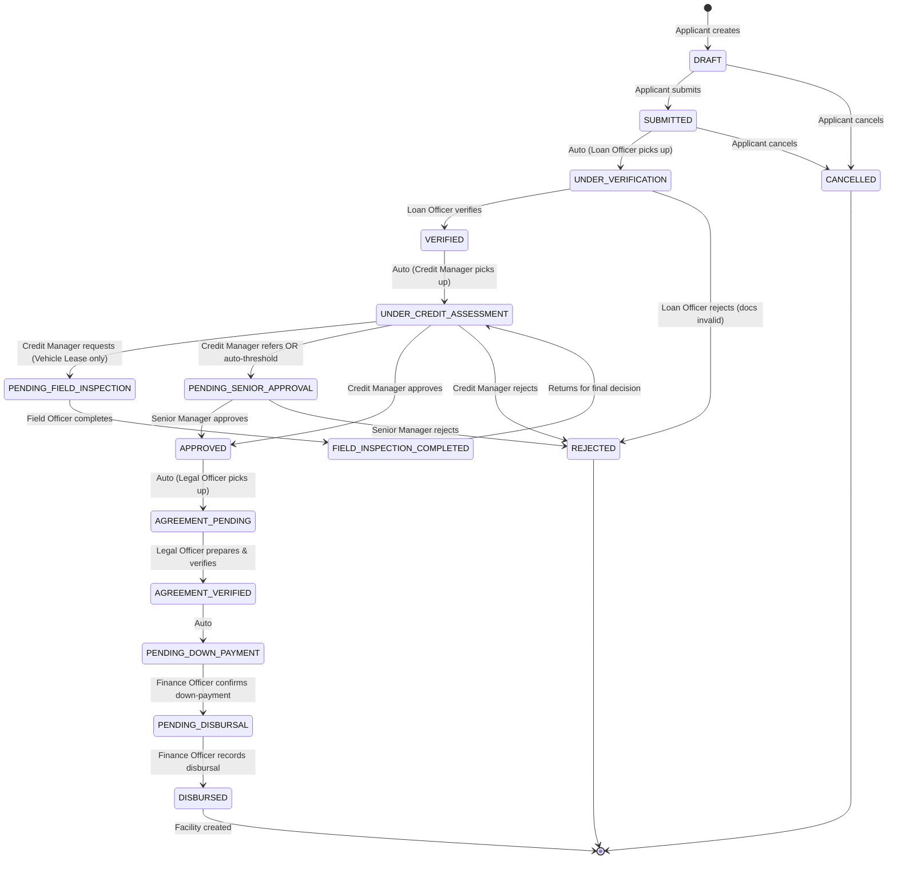
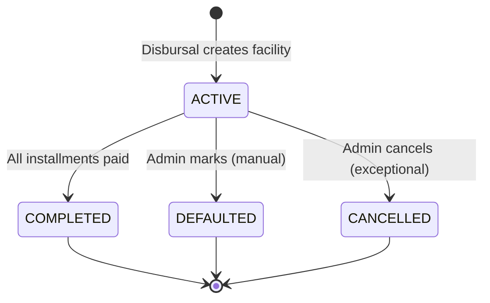
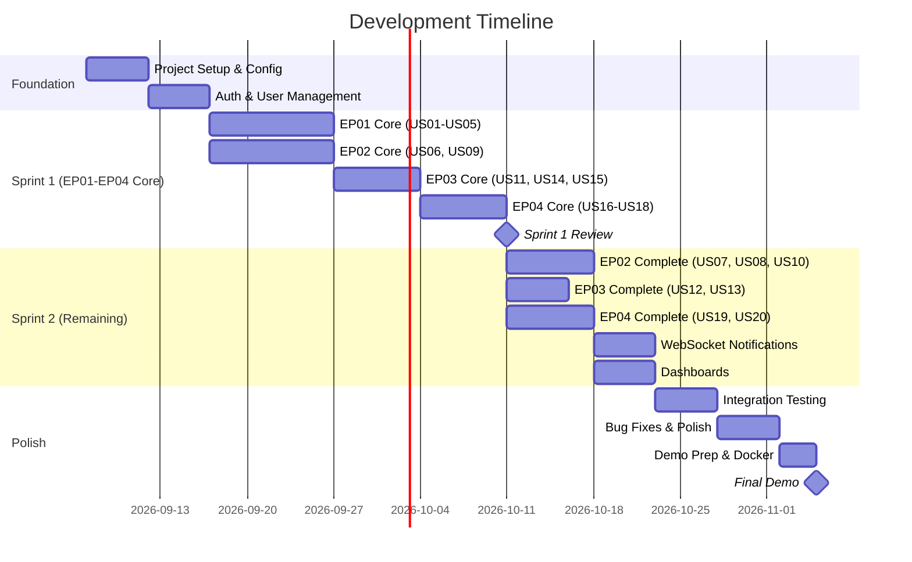

# Smart Line Investment — Loan & Leasing Management System
## Complete Implementation Plan

---

## 1. Project Understanding

**Client**: Smart Line Investment  
**System**: Web-Based Loan and Leasing Management System  
**Purpose**: Digitize the company's manual/Excel-based workflow for **Money Loan** and **Vehicle Leasing** services.

The system covers the complete business lifecycle through four Epics:

| Epic | Name | Scope |
|------|------|-------|
| EP01 | Loan & Lease Application Intake & Verification | Application submission, document upload, verification |
| EP02 | Credit Assessment & Risk Evaluation | Financial review, vehicle inspection, guarantor verification, approval/rejection |
| EP03 | Agreement Execution & Disbursal | Agreement preparation, down-payment, disbursal, facility activation |
| EP04 | Repayment Tracking & Collection Management | Installment schedules, payments, overdue monitoring, collection follow-ups |

**9 Distinct Roles**: Applicant, Loan Officer, Field Officer, Credit Manager, Senior Manager, Legal Officer, Finance Officer, Credit Control Officer, Admin.

**Team Size**: 4 members | **Timeline**: 13 weeks | **Sprint 1**: ≥50% User Stories from every Epic

---

## 2. Functional Scope

### 20 User Stories (Complete Coverage)

#### EP01 — Application Intake & Verification
| ID | Story | Role |
|----|-------|------|
| US01 | Applicant creates an account and selects Loan or Vehicle Leasing | Applicant |
| US02 | Applicant enters personal, financial, and application information | Applicant |
| US03 | Applicant uploads supporting documents and guarantor information | Applicant |
| US04 | Loan Officer reviews submitted application information/documents | Loan Officer |
| US05 | Loan Officer updates application verification status | Loan Officer |

#### EP02 — Credit Assessment & Risk Evaluation
| ID | Story | Role |
|----|-------|------|
| US06 | Credit Manager reviews financial and credit information | Credit Manager |
| US07 | Field Officer records vehicle inspection and valuation details | Field Officer |
| US08 | Credit Manager verifies guarantor information | Credit Manager |
| US09 | Credit Manager records approval/rejection decision with reason | Credit Manager |
| US10 | Senior Manager reviews applications requiring higher-level authorization | Senior Manager |

#### EP03 — Agreement Execution & Disbursal
| ID | Story | Role |
|----|-------|------|
| US11 | Legal Officer prepares Loan/Vehicle Leasing agreement | Legal Officer |
| US12 | Legal Officer verifies agreement information | Legal Officer |
| US13 | Applicant views agreement details | Applicant |
| US14 | Finance Officer records required down-payment | Finance Officer |
| US15 | Finance Officer records disbursal and activates the facility | Finance Officer |

#### EP04 — Repayment Tracking & Collection Management
| ID | Story | Role |
|----|-------|------|
| US16 | Finance Officer creates installment schedules | Finance Officer |
| US17 | Finance Officer records/updates installment payments | Finance Officer |
| US18 | Applicant views installment schedule and repayment history | Applicant |
| US19 | Credit Control Officer views outstanding/overdue installments and records collection follow-ups | Credit Control Officer |
| US20 | Admin manages repayment/collection records with appropriate permissions | Admin |

---

## 3. Assumptions & TBD Requirements

### Confirmed Design Decisions (from interview)
- ✅ Monorepo (`/frontend` + `/backend`)
- ✅ JWT authentication (stateless)
- ✅ Single `Application` entity with type discriminator + child tables
- ✅ Separate `User` and `Applicant` tables (1:1)
- ✅ Single role per user (ENUM)
- ✅ Local filesystem for document storage
- ✅ Status field + audit history table for workflow tracking
- ✅ Separate `Facility` entity post-disbursal
- ✅ Auto-generated installment schedules from parameters
- ✅ Separate `Vehicle` + `VehicleCategory` tables
- ✅ Multiple guarantors per application
- ✅ React Context + React Query for state management
- ✅ Vite + React (JavaScript)
- ✅ Tailwind CSS v3.x + Ant Design
- ✅ WebSocket (Spring WebSocket + STOMP) for real-time notifications
- ✅ Manual credit assessment (no AI/ML)
- ✅ Dual senior approval trigger (auto threshold + manual referral)
- ✅ System config table for thresholds
- ✅ iText 7 for PDF agreement generation
- ✅ MapStruct for entity ↔ DTO mapping
- ✅ JPA `ddl-auto=update` for schema management
- ✅ SpringDoc OpenAPI (Swagger UI)
- ✅ Self-registration for applicants (no email verification)
- ✅ Backend-focused testing (JUnit 5 + Mockito)
- ✅ Local MySQL during dev, full Docker at end
- ✅ Git Flow: `main` + `develop` + feature branches
- ✅ Vertical team slicing by Epic
- ✅ Dark theme + minimalist UI
- ✅ Java 17 + Spring Boot 3.2.x

### TBD — Requires Client Confirmation

> [!WARNING]
> The following items are NOT defined in the proposal and require client confirmation before implementation. Default values are assumed where noted.

| # | Item | Assumed Default | Impact |
|---|------|----------------|--------|
| TBD-01 | Interest calculation method (flat rate vs. reducing balance) | Flat rate | Installment calculation formula |
| TBD-02 | Minimum/maximum number of guarantors per application | Min: 1, Max: 3 | Guarantor form validation |
| TBD-03 | Senior Manager approval threshold amount | LKR 500,000 (configurable) | Auto-escalation logic |
| TBD-04 | Maximum loan/lease amount | No limit enforced | Application validation |
| TBD-05 | Minimum/maximum tenure (months) | 3–60 months | Application form |
| TBD-06 | Accepted document types for upload | PDF, JPG, PNG (max 5MB each) | Upload validation |
| TBD-07 | Down-payment percentage/formula | Manually entered by Finance Officer | Down-payment calculation |
| TBD-08 | Overdue grace period (days after due date) | 0 days (overdue on due date) | Overdue detection |
| TBD-09 | Late payment penalty/fee structure | Not implemented (no penalty calc) | Payment model |
| TBD-10 | Vehicle leasing category list beyond bikes | MOTORCYCLE only (extensible) | VehicleCategory seed data |
| TBD-11 | NIC format validation rules | Basic format check (alphanumeric) | Registration validation |
| TBD-12 | Can an applicant have multiple active applications? | Yes, one per type | Application uniqueness constraint |
| TBD-13 | Can an applicant withdraw an application? | Yes, before APPROVED status | Cancellation logic |
| TBD-14 | Agreement template content and terms | Generic template fields | PDF template |
| TBD-15 | Currency (LKR assumed) | LKR | Display formatting |

---

## 4. Recommended Architecture

### High-Level Architecture

```
┌─────────────────────────────────────────────────────────┐
│                     CLIENT BROWSER                       │
│  ┌─────────────────────────────────────────────────────┐ │
│  │          React + Vite + Ant Design + Tailwind       │ │
│  │  ┌──────────┐ ┌──────────┐ ┌───────────────────┐   │ │
│  │  │  Auth     │ │  React   │ │  STOMP/WebSocket  │   │ │
│  │  │  Context  │ │  Query   │ │  Client           │   │ │
│  │  └──────────┘ └──────────┘ └───────────────────┘   │ │
│  └─────────────────────────────────────────────────────┘ │
└─────────────────────┬───────────────────────────────────┘
                      │ HTTP/REST + WebSocket
                      ▼
┌─────────────────────────────────────────────────────────┐
│                   SPRING BOOT 3.2.x                      │
│  ┌──────────┐ ┌──────────┐ ┌──────────┐ ┌────────────┐ │
│  │ Security │ │Controller│ │  Service  │ │ WebSocket  │ │
│  │ (JWT +   │ │  (REST)  │ │  (Logic)  │ │ (STOMP)    │ │
│  │  RBAC)   │ │          │ │           │ │            │ │
│  └──────────┘ └──────────┘ └──────────┘ └────────────┘ │
│  ┌──────────┐ ┌──────────┐ ┌──────────┐ ┌────────────┐ │
│  │Repository│ │  Entity  │ │   DTO    │ │  MapStruct │ │
│  │  (JPA)   │ │  (Model) │ │          │ │  Mapper    │ │
│  └──────────┘ └──────────┘ └──────────┘ └────────────┘ │
│  ┌──────────┐ ┌──────────┐ ┌──────────┐               │
│  │ iText 7  │ │ SpringDoc│ │Validation│               │
│  │ (PDF)    │ │ (Swagger)│ │          │               │
│  └──────────┘ └──────────┘ └──────────┘               │
└─────────────────────┬───────────────────────────────────┘
                      │ JPA/JDBC
                      ▼
┌─────────────────────────────────────────────────────────┐
│                      MySQL 8.0                           │
│  ┌──────────────────────────────────────────────────┐   │
│  │  users, applicants, applications, facilities,     │   │
│  │  guarantors, vehicles, agreements, installments,  │   │
│  │  payments, notifications, audit_log, etc.         │   │
│  └──────────────────────────────────────────────────┘   │
└─────────────────────────────────────────────────────────┘
                      │
          ┌───────────┴───────────┐
          ▼                       ▼
    ┌──────────┐           ┌──────────┐
    │ File     │           │ Generated│
    │ System   │           │ PDFs     │
    │(uploads/)│           │          │
    └──────────┘           └──────────┘
```

### Why This Architecture

| Decision | Rationale |
|----------|-----------|
| Monorepo | 4-member team, simplified coordination |
| Stateless JWT | Standard for SPA + REST, no server session store |
| Layered backend | Clean separation: Controller → Service → Repository |
| MapStruct | Compile-time DTO mapping, type-safe, zero runtime overhead |
| React Query | Eliminates boilerplate for server state, caching, pagination |
| WebSocket/STOMP | Real-time notifications for multi-role workflow |
| Local file storage | Zero infra dependencies for academic project |
| iText 7 | Professional PDF generation for agreements |
| AntD + Tailwind | AntD for complex widgets (tables, forms), Tailwind for layout/spacing |

---

## 5. Frontend Architecture

### Technology Stack
| Technology | Version | Purpose |
|------------|---------|---------|
| React | 18.x | UI framework |
| Vite | 5.x | Build tool & dev server |
| JavaScript | ES2022+ | Language |
| Tailwind CSS | 3.4.x | Utility-first styling |
| Ant Design | 5.x | Component library |
| React Router | 6.x | Client-side routing |
| React Query (TanStack) | 5.x | Server state management |
| Axios | 1.x | HTTP client |
| @stomp/stompjs | 7.x | WebSocket STOMP client |
| SockJS | 1.x | WebSocket fallback |
| dayjs | 1.x | Date formatting (AntD default) |

### Frontend Directory Structure

```
frontend/
├── public/
│   ├── favicon.ico
│   └── logo.svg
├── src/
│   ├── api/                        # API client functions
│   │   ├── axiosConfig.js          # Axios instance with interceptors
│   │   ├── authApi.js              # Login, register, refresh
│   │   ├── applicationApi.js       # Application CRUD
│   │   ├── creditApi.js            # Credit assessment APIs
│   │   ├── agreementApi.js         # Agreement APIs
│   │   ├── facilityApi.js          # Facility/disbursal APIs
│   │   ├── installmentApi.js       # Installment/payment APIs
│   │   ├── collectionApi.js        # Collection follow-up APIs
│   │   ├── documentApi.js          # File upload/download
│   │   ├── notificationApi.js      # Notification APIs
│   │   └── adminApi.js             # Admin management APIs
│   │
│   ├── components/                 # Reusable UI components
│   │   ├── common/
│   │   │   ├── AppHeader.jsx       # Top header with user info & notifications
│   │   │   ├── AppSidebar.jsx      # Role-based sidebar navigation
│   │   │   ├── DashboardLayout.jsx # Main layout wrapper (sidebar + header + content)
│   │   │   ├── ProtectedRoute.jsx  # Route guard (auth + role check)
│   │   │   ├── StatusBadge.jsx     # Colored status badge component
│   │   │   ├── StatusTimeline.jsx  # Application status history timeline
│   │   │   ├── LoadingSpinner.jsx  # Loading state
│   │   │   ├── ErrorDisplay.jsx    # Error state display
│   │   │   ├── EmptyState.jsx      # Empty data state
│   │   │   ├── PageHeader.jsx      # Page title + breadcrumb + actions
│   │   │   ├── ConfirmModal.jsx    # Reusable confirmation dialog
│   │   │   ├── StatCard.jsx        # Dashboard metric card
│   │   │   └── NotificationBell.jsx# Notification dropdown
│   │   │
│   │   ├── application/
│   │   │   ├── ApplicationForm.jsx         # Multi-step application form
│   │   │   ├── PersonalInfoStep.jsx        # Step 1: personal info
│   │   │   ├── FinancialInfoStep.jsx       # Step 2: financial info
│   │   │   ├── LoanDetailsStep.jsx         # Step 3a: loan-specific fields
│   │   │   ├── VehicleLeaseDetailsStep.jsx # Step 3b: vehicle lease fields
│   │   │   ├── GuarantorForm.jsx           # Add/edit guarantor
│   │   │   ├── DocumentUpload.jsx          # File upload with preview
│   │   │   ├── ApplicationSummary.jsx      # Review before submit
│   │   │   ├── ApplicationCard.jsx         # Application list card
│   │   │   └── ApplicationDetailView.jsx   # Full application detail
│   │   │
│   │   ├── verification/
│   │   │   ├── VerificationChecklist.jsx   # Document verification form
│   │   │   └── VerificationStatusForm.jsx  # Update verification status
│   │   │
│   │   ├── credit/
│   │   │   ├── CreditAssessmentForm.jsx    # Credit evaluation form
│   │   │   ├── GuarantorVerification.jsx   # Guarantor review panel
│   │   │   ├── VehicleInspectionForm.jsx   # Field officer inspection form
│   │   │   ├── DecisionForm.jsx            # Approve/reject/refer form
│   │   │   └── AuthorizationReview.jsx     # Senior manager review
│   │   │
│   │   ├── agreement/
│   │   │   ├── AgreementForm.jsx           # Agreement preparation form
│   │   │   ├── AgreementVerification.jsx   # Agreement review
│   │   │   ├── AgreementView.jsx           # Applicant-facing agreement view
│   │   │   └── AgreementPdfDownload.jsx    # PDF download button
│   │   │
│   │   ├── facility/
│   │   │   ├── DownPaymentForm.jsx         # Record down-payment
│   │   │   ├── DisbursalForm.jsx           # Record disbursal
│   │   │   ├── InstallmentScheduleForm.jsx # Create schedule parameters
│   │   │   ├── InstallmentTable.jsx        # Installment schedule table
│   │   │   ├── PaymentForm.jsx             # Record payment
│   │   │   └── PaymentHistory.jsx          # Payment history list
│   │   │
│   │   ├── collection/
│   │   │   ├── OverdueInstallmentTable.jsx # Overdue installments list
│   │   │   └── FollowUpForm.jsx            # Record collection follow-up
│   │   │
│   │   └── admin/
│   │       ├── UserManagement.jsx          # User CRUD table
│   │       ├── UserForm.jsx                # Create/edit user
│   │       ├── RoleManagement.jsx          # Role management
│   │       ├── SystemConfig.jsx            # System settings
│   │       └── AuditLog.jsx                # Audit trail viewer
│   │
│   ├── contexts/
│   │   ├── AuthContext.jsx         # Auth state (user, token, role)
│   │   ├── NotificationContext.jsx # WebSocket notification state
│   │   └── ThemeContext.jsx        # Theme configuration
│   │
│   ├── hooks/
│   │   ├── useAuth.js              # Auth context consumer hook
│   │   ├── useNotifications.js     # WebSocket subscription hook
│   │   ├── useApplications.js      # React Query hooks for applications
│   │   ├── useFacilities.js        # React Query hooks for facilities
│   │   └── useDebounce.js          # Input debounce utility
│   │
│   ├── pages/                      # Route-level page components
│   │   ├── auth/
│   │   │   ├── LoginPage.jsx
│   │   │   └── RegisterPage.jsx
│   │   │
│   │   ├── applicant/
│   │   │   ├── ApplicantDashboard.jsx
│   │   │   ├── NewApplicationPage.jsx
│   │   │   ├── MyApplicationsPage.jsx
│   │   │   ├── ApplicationStatusPage.jsx
│   │   │   ├── AgreementViewPage.jsx
│   │   │   └── PaymentHistoryPage.jsx
│   │   │
│   │   ├── loan-officer/
│   │   │   ├── LODashboard.jsx
│   │   │   ├── ApplicationQueuePage.jsx
│   │   │   └── ApplicationVerificationPage.jsx
│   │   │
│   │   ├── field-officer/
│   │   │   ├── FODashboard.jsx
│   │   │   └── VehicleInspectionPage.jsx
│   │   │
│   │   ├── credit-manager/
│   │   │   ├── CMDashboard.jsx
│   │   │   └── CreditAssessmentPage.jsx
│   │   │
│   │   ├── senior-manager/
│   │   │   ├── SMDashboard.jsx
│   │   │   └── AuthorizationPage.jsx
│   │   │
│   │   ├── legal-officer/
│   │   │   ├── LegalDashboard.jsx
│   │   │   └── AgreementPreparationPage.jsx
│   │   │
│   │   ├── finance-officer/
│   │   │   ├── FinanceDashboard.jsx
│   │   │   ├── DownPaymentPage.jsx
│   │   │   ├── DisbursalPage.jsx
│   │   │   ├── InstallmentSchedulePage.jsx
│   │   │   └── PaymentManagementPage.jsx
│   │   │
│   │   ├── credit-control/
│   │   │   ├── CCDashboard.jsx
│   │   │   └── CollectionManagementPage.jsx
│   │   │
│   │   └── admin/
│   │       ├── AdminDashboard.jsx
│   │       ├── UserManagementPage.jsx
│   │       └── SystemConfigPage.jsx
│   │
│   ├── routes/
│   │   └── AppRoutes.jsx           # Centralized route definitions
│   │
│   ├── utils/
│   │   ├── constants.js            # Status enums, role constants
│   │   ├── formatters.js           # Currency, date formatting
│   │   ├── validators.js           # Form validation helpers
│   │   └── permissions.js          # Role-permission checks
│   │
│   ├── styles/
│   │   ├── index.css               # Tailwind directives + global styles
│   │   └── antd-overrides.css      # AntD theme customizations
│   │
│   ├── App.jsx                     # Root component
│   └── main.jsx                    # Entry point
│
├── .env                            # VITE_API_URL, VITE_WS_URL
├── .env.example
├── index.html
├── package.json
├── vite.config.js
├── tailwind.config.js
├── postcss.config.js
└── jsconfig.json                   # Path aliases
```

---

## 6. Backend Architecture

### Technology Stack
| Technology | Version | Purpose |
|------------|---------|---------|
| Java | 17 (LTS) | Language |
| Spring Boot | 3.2.x | Framework |
| Spring Security | 6.x | Authentication & Authorization |
| Spring Data JPA | 3.x | Data access |
| Spring WebSocket | 6.x | Real-time notifications |
| Hibernate | 6.x | ORM |
| MySQL Connector | 8.x | JDBC driver |
| jjwt (io.jsonwebtoken) | 0.12.x | JWT creation & validation |
| MapStruct | 1.5.x | Entity ↔ DTO mapping |
| Lombok | 1.18.x | Boilerplate reduction |
| SpringDoc OpenAPI | 2.3.x | API documentation (Swagger UI) |
| iText 7 | 7.2.x (Community) | PDF agreement generation |
| Bean Validation | 3.x | Request validation |

### Backend Directory Structure

```
backend/
├── src/
│   ├── main/
│   │   ├── java/com/smartline/lms/
│   │   │   │
│   │   │   ├── LmsApplication.java              # Main entry point
│   │   │   │
│   │   │   ├── config/                           # Configuration
│   │   │   │   ├── SecurityConfig.java           # Spring Security config
│   │   │   │   ├── JwtConfig.java                # JWT properties
│   │   │   │   ├── WebSocketConfig.java          # STOMP/WebSocket config
│   │   │   │   ├── CorsConfig.java               # CORS settings
│   │   │   │   ├── OpenApiConfig.java             # Swagger config
│   │   │   │   └── FileStorageConfig.java         # Upload directory config
│   │   │   │
│   │   │   ├── security/                          # Security components
│   │   │   │   ├── JwtTokenProvider.java          # JWT generation/validation
│   │   │   │   ├── JwtAuthenticationFilter.java   # Request filter
│   │   │   │   ├── JwtAuthenticationEntryPoint.java # 401 handler
│   │   │   │   ├── CustomUserDetailsService.java  # UserDetails loader
│   │   │   │   └── CurrentUser.java               # @CurrentUser annotation
│   │   │   │
│   │   │   ├── entity/                            # JPA Entities
│   │   │   │   ├── User.java
│   │   │   │   ├── Applicant.java
│   │   │   │   ├── Application.java
│   │   │   │   ├── LoanDetail.java
│   │   │   │   ├── VehicleLeaseDetail.java
│   │   │   │   ├── Guarantor.java
│   │   │   │   ├── Document.java
│   │   │   │   ├── Vehicle.java
│   │   │   │   ├── VehicleInspection.java
│   │   │   │   ├── CreditAssessment.java
│   │   │   │   ├── Agreement.java
│   │   │   │   ├── DownPayment.java
│   │   │   │   ├── Facility.java
│   │   │   │   ├── InstallmentSchedule.java
│   │   │   │   ├── Installment.java
│   │   │   │   ├── Payment.java
│   │   │   │   ├── CollectionFollowUp.java
│   │   │   │   ├── Notification.java
│   │   │   │   ├── ApplicationStatusHistory.java
│   │   │   │   ├── SystemConfig.java
│   │   │   │   └── enums/
│   │   │   │       ├── Role.java
│   │   │   │       ├── ApplicationType.java
│   │   │   │       ├── ApplicationStatus.java
│   │   │   │       ├── FacilityStatus.java
│   │   │   │       ├── VerificationStatus.java
│   │   │   │       ├── GuarantorVerificationStatus.java
│   │   │   │       ├── CreditDecision.java
│   │   │   │       ├── RiskLevel.java
│   │   │   │       ├── AgreementStatus.java
│   │   │   │       ├── DownPaymentStatus.java
│   │   │   │       ├── InstallmentStatus.java
│   │   │   │       ├── PaymentMethod.java
│   │   │   │       ├── ContactMethod.java
│   │   │   │       ├── ContactOutcome.java
│   │   │   │       ├── VehicleCategory.java
│   │   │   │       ├── VehicleCondition.java
│   │   │   │       └── DocumentType.java
│   │   │   │
│   │   │   ├── dto/                               # Data Transfer Objects
│   │   │   │   ├── request/
│   │   │   │   │   ├── LoginRequest.java
│   │   │   │   │   ├── RegisterRequest.java
│   │   │   │   │   ├── ApplicationCreateRequest.java
│   │   │   │   │   ├── PersonalInfoRequest.java
│   │   │   │   │   ├── FinancialInfoRequest.java
│   │   │   │   │   ├── LoanDetailRequest.java
│   │   │   │   │   ├── VehicleLeaseDetailRequest.java
│   │   │   │   │   ├── GuarantorRequest.java
│   │   │   │   │   ├── VerificationRequest.java
│   │   │   │   │   ├── CreditAssessmentRequest.java
│   │   │   │   │   ├── CreditDecisionRequest.java
│   │   │   │   │   ├── VehicleInspectionRequest.java
│   │   │   │   │   ├── GuarantorVerificationRequest.java
│   │   │   │   │   ├── AuthorizationDecisionRequest.java
│   │   │   │   │   ├── AgreementCreateRequest.java
│   │   │   │   │   ├── AgreementVerifyRequest.java
│   │   │   │   │   ├── DownPaymentRequest.java
│   │   │   │   │   ├── DisbursalRequest.java
│   │   │   │   │   ├── InstallmentScheduleRequest.java
│   │   │   │   │   ├── PaymentRequest.java
│   │   │   │   │   ├── CollectionFollowUpRequest.java
│   │   │   │   │   ├── CreateUserRequest.java
│   │   │   │   │   └── SystemConfigRequest.java
│   │   │   │   │
│   │   │   │   └── response/
│   │   │   │       ├── AuthResponse.java
│   │   │   │       ├── UserResponse.java
│   │   │   │       ├── ApplicantResponse.java
│   │   │   │       ├── ApplicationResponse.java
│   │   │   │       ├── ApplicationDetailResponse.java
│   │   │   │       ├── ApplicationListResponse.java
│   │   │   │       ├── GuarantorResponse.java
│   │   │   │       ├── DocumentResponse.java
│   │   │   │       ├── CreditAssessmentResponse.java
│   │   │   │       ├── VehicleInspectionResponse.java
│   │   │   │       ├── AgreementResponse.java
│   │   │   │       ├── DownPaymentResponse.java
│   │   │   │       ├── FacilityResponse.java
│   │   │   │       ├── InstallmentResponse.java
│   │   │   │       ├── PaymentResponse.java
│   │   │   │       ├── CollectionFollowUpResponse.java
│   │   │   │       ├── NotificationResponse.java
│   │   │   │       ├── DashboardStatsResponse.java
│   │   │   │       ├── StatusHistoryResponse.java
│   │   │   │       ├── ApiErrorResponse.java
│   │   │   │       └── PagedResponse.java
│   │   │   │
│   │   │   ├── mapper/                            # MapStruct Mappers
│   │   │   │   ├── UserMapper.java
│   │   │   │   ├── ApplicationMapper.java
│   │   │   │   ├── GuarantorMapper.java
│   │   │   │   ├── CreditAssessmentMapper.java
│   │   │   │   ├── AgreementMapper.java
│   │   │   │   ├── FacilityMapper.java
│   │   │   │   ├── InstallmentMapper.java
│   │   │   │   ├── PaymentMapper.java
│   │   │   │   └── CollectionFollowUpMapper.java
│   │   │   │
│   │   │   ├── repository/                        # Spring Data JPA Repos
│   │   │   │   ├── UserRepository.java
│   │   │   │   ├── ApplicantRepository.java
│   │   │   │   ├── ApplicationRepository.java
│   │   │   │   ├── LoanDetailRepository.java
│   │   │   │   ├── VehicleLeaseDetailRepository.java
│   │   │   │   ├── GuarantorRepository.java
│   │   │   │   ├── DocumentRepository.java
│   │   │   │   ├── VehicleRepository.java
│   │   │   │   ├── VehicleInspectionRepository.java
│   │   │   │   ├── CreditAssessmentRepository.java
│   │   │   │   ├── AgreementRepository.java
│   │   │   │   ├── DownPaymentRepository.java
│   │   │   │   ├── FacilityRepository.java
│   │   │   │   ├── InstallmentScheduleRepository.java
│   │   │   │   ├── InstallmentRepository.java
│   │   │   │   ├── PaymentRepository.java
│   │   │   │   ├── CollectionFollowUpRepository.java
│   │   │   │   ├── NotificationRepository.java
│   │   │   │   ├── ApplicationStatusHistoryRepository.java
│   │   │   │   └── SystemConfigRepository.java
│   │   │   │
│   │   │   ├── service/                           # Business Logic
│   │   │   │   ├── AuthService.java
│   │   │   │   ├── UserService.java
│   │   │   │   ├── ApplicantService.java
│   │   │   │   ├── ApplicationService.java
│   │   │   │   ├── DocumentService.java
│   │   │   │   ├── GuarantorService.java
│   │   │   │   ├── VerificationService.java
│   │   │   │   ├── CreditAssessmentService.java
│   │   │   │   ├── VehicleInspectionService.java
│   │   │   │   ├── AuthorizationService.java
│   │   │   │   ├── AgreementService.java
│   │   │   │   ├── AgreementPdfService.java
│   │   │   │   ├── DownPaymentService.java
│   │   │   │   ├── DisbursalService.java
│   │   │   │   ├── FacilityService.java
│   │   │   │   ├── InstallmentService.java
│   │   │   │   ├── PaymentService.java
│   │   │   │   ├── CollectionService.java
│   │   │   │   ├── NotificationService.java
│   │   │   │   ├── FileStorageService.java
│   │   │   │   ├── DashboardService.java
│   │   │   │   ├── SystemConfigService.java
│   │   │   │   └── workflow/
│   │   │   │       ├── ApplicationStateMachine.java   # State transition rules
│   │   │   │       └── WorkflowValidationService.java # Transition validation
│   │   │   │
│   │   │   ├── controller/                        # REST Controllers
│   │   │   │   ├── AuthController.java
│   │   │   │   ├── UserController.java
│   │   │   │   ├── ApplicationController.java
│   │   │   │   ├── DocumentController.java
│   │   │   │   ├── GuarantorController.java
│   │   │   │   ├── VerificationController.java
│   │   │   │   ├── CreditAssessmentController.java
│   │   │   │   ├── VehicleInspectionController.java
│   │   │   │   ├── AuthorizationController.java
│   │   │   │   ├── AgreementController.java
│   │   │   │   ├── DownPaymentController.java
│   │   │   │   ├── DisbursalController.java
│   │   │   │   ├── FacilityController.java
│   │   │   │   ├── InstallmentController.java
│   │   │   │   ├── PaymentController.java
│   │   │   │   ├── CollectionController.java
│   │   │   │   ├── NotificationController.java
│   │   │   │   ├── DashboardController.java
│   │   │   │   └── AdminController.java
│   │   │   │
│   │   │   ├── exception/                         # Exception Handling
│   │   │   │   ├── GlobalExceptionHandler.java    # @ControllerAdvice
│   │   │   │   ├── ResourceNotFoundException.java
│   │   │   │   ├── BadRequestException.java
│   │   │   │   ├── UnauthorizedException.java
│   │   │   │   ├── ForbiddenException.java
│   │   │   │   ├── InvalidStateTransitionException.java
│   │   │   │   ├── FileStorageException.java
│   │   │   │   └── DuplicateResourceException.java
│   │   │   │
│   │   │   └── validation/                        # Custom Validators
│   │   │       ├── ApplicationValidator.java
│   │   │       ├── StateTransitionValidator.java
│   │   │       └── FileValidator.java
│   │   │
│   │   └── resources/
│   │       ├── application.yml                    # Main config
│   │       ├── application-dev.yml                # Dev profile
│   │       ├── application-prod.yml               # Production profile
│   │       └── templates/
│   │           └── agreement-template.html         # iText PDF template (if using HTML base)
│   │
│   └── test/
│       └── java/com/smartline/lms/
│           ├── service/
│           │   ├── ApplicationServiceTest.java
│           │   ├── WorkflowValidationServiceTest.java
│           │   ├── InstallmentServiceTest.java
│           │   ├── PaymentServiceTest.java
│           │   └── AuthServiceTest.java
│           ├── controller/
│           │   ├── AuthControllerTest.java
│           │   ├── ApplicationControllerTest.java
│           │   └── PaymentControllerTest.java
│           ├── repository/
│           │   ├── ApplicationRepositoryTest.java
│           │   └── InstallmentRepositoryTest.java
│           └── security/
│               └── RoleAuthorizationTest.java
│
├── uploads/                                       # File upload directory (gitignored)
├── pom.xml
└── .env
```

### Key Service Responsibilities

| Service | Responsibility |
|---------|---------------|
| `AuthService` | Login, register, JWT token management, refresh |
| `ApplicationService` | Create, submit, update applications; enforce state transitions |
| `WorkflowValidationService` | Validate state transitions, check preconditions |
| `ApplicationStateMachine` | Define valid transitions and role permissions |
| `VerificationService` | Loan Officer verification actions |
| `CreditAssessmentService` | Credit Manager assessment, guarantor verification |
| `VehicleInspectionService` | Field Officer vehicle inspection recording |
| `AuthorizationService` | Senior Manager authorization decisions |
| `AgreementService` | Agreement creation, verification |
| `AgreementPdfService` | Generate PDF agreements using iText 7 |
| `DownPaymentService` | Record and verify down-payments |
| `DisbursalService` | Record disbursal, create Facility |
| `InstallmentService` | Generate installment schedules, manage installments |
| `PaymentService` | Record payments, update installment statuses |
| `CollectionService` | Manage overdue monitoring and follow-ups |
| `NotificationService` | Create and push notifications via WebSocket |
| `FileStorageService` | File upload, download, validation, storage |
| `DashboardService` | Aggregate metrics for role-specific dashboards |

### Transaction Boundaries

All service methods that modify data are wrapped in `@Transactional`. Critical multi-table operations:

| Operation | Tables Affected | Transaction Scope |
|-----------|----------------|-------------------|
| Submit Application | Application, ApplicationStatusHistory, Notification | Single transaction |
| Credit Decision (Approve) | Application, CreditAssessment, ApplicationStatusHistory, Notification | Single transaction |
| Disbursal + Facility Activation | Application, Facility, DownPayment (verify), ApplicationStatusHistory, Notification | Single transaction |
| Generate Installment Schedule | InstallmentSchedule, Installment (N rows), Facility (update) | Single transaction |
| Record Payment | Payment, Installment (update status), Facility (update balance) | Single transaction |

---

## 7. Database ER Design

### Entity-Relationship Diagram



### Complete Entity List

#### Core Entities

| # | Entity | Table Name | Purpose |
|---|--------|------------|---------|
| 1 | User | `users` | All system users (authentication, role) |
| 2 | Applicant | `applicants` | Extended profile for Applicant role users |
| 3 | Application | `applications` | Loan/lease application (shared fields) |
| 4 | LoanDetail | `loan_details` | Loan-specific application data |
| 5 | VehicleLeaseDetail | `vehicle_lease_details` | Vehicle lease-specific application data |
| 6 | Guarantor | `guarantors` | Guarantor information per application |
| 7 | Document | `documents` | Uploaded document metadata |
| 8 | Vehicle | `vehicles` | Vehicle information for leasing |
| 9 | VehicleInspection | `vehicle_inspections` | Field officer inspection records |
| 10 | CreditAssessment | `credit_assessments` | Credit/risk evaluation record |
| 11 | Agreement | `agreements` | Loan/lease agreement details |
| 12 | DownPayment | `down_payments` | Pre-disbursal payment record |
| 13 | Facility | `facilities` | Active loan/lease post-disbursal |
| 14 | InstallmentSchedule | `installment_schedules` | Schedule parameters |
| 15 | Installment | `installments` | Individual installment records |
| 16 | Payment | `payments` | Payment transactions |
| 17 | CollectionFollowUp | `collection_follow_ups` | Overdue collection actions |

#### Supporting Entities

| # | Entity | Table Name | Purpose |
|---|--------|------------|---------|
| 18 | Notification | `notifications` | In-app notifications |
| 19 | ApplicationStatusHistory | `application_status_history` | Audit trail for status changes |
| 20 | SystemConfig | `system_config` | Configurable business parameters |

### Detailed Entity Definitions

#### 1. `users`
```sql
CREATE TABLE users (
    id              BIGINT AUTO_INCREMENT PRIMARY KEY,
    username        VARCHAR(50) UNIQUE NOT NULL,
    email           VARCHAR(100) UNIQUE NOT NULL,
    password_hash   VARCHAR(255) NOT NULL,
    full_name       VARCHAR(100) NOT NULL,
    role            ENUM('APPLICANT','LOAN_OFFICER','FIELD_OFFICER','CREDIT_MANAGER',
                         'SENIOR_MANAGER','LEGAL_OFFICER','FINANCE_OFFICER',
                         'CREDIT_CONTROL_OFFICER','ADMIN') NOT NULL,
    is_active       BOOLEAN DEFAULT TRUE,
    last_login_at   TIMESTAMP NULL,
    created_at      TIMESTAMP DEFAULT CURRENT_TIMESTAMP,
    updated_at      TIMESTAMP DEFAULT CURRENT_TIMESTAMP ON UPDATE CURRENT_TIMESTAMP
);
-- INDEX: idx_users_role ON users(role)
-- INDEX: idx_users_email ON users(email)
```

#### 2. `applicants`
```sql
CREATE TABLE applicants (
    id                  BIGINT AUTO_INCREMENT PRIMARY KEY,
    user_id             BIGINT UNIQUE NOT NULL,
    nic                 VARCHAR(20) UNIQUE NOT NULL,
    full_name           VARCHAR(150) NOT NULL,
    date_of_birth       DATE NOT NULL,
    gender              ENUM('MALE','FEMALE','OTHER'),
    address             TEXT NOT NULL,
    city                VARCHAR(100),
    phone               VARCHAR(20) NOT NULL,
    occupation          VARCHAR(100),
    employer_name       VARCHAR(150),
    employment_type     ENUM('EMPLOYED','SELF_EMPLOYED','BUSINESS','OTHER'),
    monthly_income      DECIMAL(15,2),
    additional_income   DECIMAL(15,2) DEFAULT 0,
    created_at          TIMESTAMP DEFAULT CURRENT_TIMESTAMP,
    updated_at          TIMESTAMP DEFAULT CURRENT_TIMESTAMP ON UPDATE CURRENT_TIMESTAMP,
    FOREIGN KEY (user_id) REFERENCES users(id)
);
-- INDEX: idx_applicants_nic ON applicants(nic)
```

#### 3. `applications`
```sql
CREATE TABLE applications (
    id                  BIGINT AUTO_INCREMENT PRIMARY KEY,
    application_number  VARCHAR(20) UNIQUE NOT NULL,       -- e.g., APP-2026-00001
    applicant_id        BIGINT NOT NULL,
    type                ENUM('LOAN','VEHICLE_LEASE') NOT NULL,
    status              ENUM('DRAFT','SUBMITTED','UNDER_VERIFICATION','VERIFIED',
                             'UNDER_CREDIT_ASSESSMENT','PENDING_FIELD_INSPECTION',
                             'FIELD_INSPECTION_COMPLETED','PENDING_SENIOR_APPROVAL',
                             'APPROVED','REJECTED','AGREEMENT_PENDING','AGREEMENT_VERIFIED',
                             'PENDING_DOWN_PAYMENT','PENDING_DISBURSAL','DISBURSED',
                             'CANCELLED') NOT NULL DEFAULT 'DRAFT',
    requested_amount    DECIMAL(15,2) NOT NULL,
    purpose             TEXT,
    submitted_at        TIMESTAMP NULL,
    verified_by         BIGINT NULL,
    verified_at         TIMESTAMP NULL,
    decided_by          BIGINT NULL,
    decided_at          TIMESTAMP NULL,
    rejection_reason    TEXT NULL,
    created_at          TIMESTAMP DEFAULT CURRENT_TIMESTAMP,
    updated_at          TIMESTAMP DEFAULT CURRENT_TIMESTAMP ON UPDATE CURRENT_TIMESTAMP,
    FOREIGN KEY (applicant_id) REFERENCES applicants(id),
    FOREIGN KEY (verified_by) REFERENCES users(id),
    FOREIGN KEY (decided_by) REFERENCES users(id)
);
-- INDEX: idx_applications_status ON applications(status)
-- INDEX: idx_applications_applicant ON applications(applicant_id)
-- INDEX: idx_applications_type ON applications(type)
-- INDEX: idx_applications_number ON applications(application_number)
```

#### 4. `loan_details`
```sql
CREATE TABLE loan_details (
    id                  BIGINT AUTO_INCREMENT PRIMARY KEY,
    application_id      BIGINT UNIQUE NOT NULL,
    loan_purpose        VARCHAR(255),
    requested_tenure    INT,                          -- months
    proposed_interest_rate DECIMAL(5,2),
    existing_loans      TEXT,                         -- description of existing loans
    total_existing_debt DECIMAL(15,2) DEFAULT 0,
    FOREIGN KEY (application_id) REFERENCES applications(id)
);
```

#### 5. `vehicle_lease_details`
```sql
CREATE TABLE vehicle_lease_details (
    id                  BIGINT AUTO_INCREMENT PRIMARY KEY,
    application_id      BIGINT UNIQUE NOT NULL,
    vehicle_category    ENUM('MOTORCYCLE','THREE_WHEELER','CAR','VAN','BUS','TRUCK','OTHER')
                        NOT NULL DEFAULT 'MOTORCYCLE',
    requested_tenure    INT,
    proposed_interest_rate DECIMAL(5,2),
    dealer_name         VARCHAR(150),
    dealer_contact      VARCHAR(50),
    FOREIGN KEY (application_id) REFERENCES applications(id)
);
```

#### 6. `guarantors`
```sql
CREATE TABLE guarantors (
    id                      BIGINT AUTO_INCREMENT PRIMARY KEY,
    application_id          BIGINT NOT NULL,
    full_name               VARCHAR(150) NOT NULL,
    nic                     VARCHAR(20) NOT NULL,
    address                 TEXT NOT NULL,
    phone                   VARCHAR(20) NOT NULL,
    relationship            VARCHAR(100),
    occupation              VARCHAR(100),
    monthly_income          DECIMAL(15,2),
    verification_status     ENUM('PENDING','VERIFIED','REJECTED') DEFAULT 'PENDING',
    verified_by             BIGINT NULL,
    verified_at             TIMESTAMP NULL,
    verification_remarks    TEXT,
    created_at              TIMESTAMP DEFAULT CURRENT_TIMESTAMP,
    FOREIGN KEY (application_id) REFERENCES applications(id),
    FOREIGN KEY (verified_by) REFERENCES users(id)
);
-- INDEX: idx_guarantors_application ON guarantors(application_id)
```

#### 7. `documents`
```sql
CREATE TABLE documents (
    id                  BIGINT AUTO_INCREMENT PRIMARY KEY,
    application_id      BIGINT NOT NULL,
    document_type       ENUM('NIC_COPY','INCOME_PROOF','BANK_STATEMENT','ADDRESS_PROOF',
                             'EMPLOYMENT_LETTER','VEHICLE_REGISTRATION','INSURANCE',
                             'GUARANTOR_NIC','GUARANTOR_INCOME_PROOF','OTHER') NOT NULL,
    original_filename   VARCHAR(255) NOT NULL,
    stored_filename     VARCHAR(255) NOT NULL,         -- UUID-based stored name
    file_path           VARCHAR(500) NOT NULL,
    file_size           BIGINT NOT NULL,
    content_type        VARCHAR(100) NOT NULL,
    verification_status ENUM('PENDING','VERIFIED','REJECTED') DEFAULT 'PENDING',
    verified_by         BIGINT NULL,
    verified_at         TIMESTAMP NULL,
    rejection_reason    TEXT,
    uploaded_at         TIMESTAMP DEFAULT CURRENT_TIMESTAMP,
    FOREIGN KEY (application_id) REFERENCES applications(id),
    FOREIGN KEY (verified_by) REFERENCES users(id)
);
-- INDEX: idx_documents_application ON documents(application_id)
```

#### 8. `vehicles`
```sql
CREATE TABLE vehicles (
    id                  BIGINT AUTO_INCREMENT PRIMARY KEY,
    vehicle_lease_detail_id BIGINT UNIQUE NOT NULL,
    category            ENUM('MOTORCYCLE','THREE_WHEELER','CAR','VAN','BUS','TRUCK','OTHER') NOT NULL,
    make                VARCHAR(100) NOT NULL,
    model               VARCHAR(100) NOT NULL,
    year                INT NOT NULL,
    registration_number VARCHAR(50),
    engine_number       VARCHAR(100),
    chassis_number      VARCHAR(100),
    color               VARCHAR(50),
    vehicle_condition   ENUM('NEW','USED') DEFAULT 'USED',
    estimated_value     DECIMAL(15,2),
    created_at          TIMESTAMP DEFAULT CURRENT_TIMESTAMP,
    FOREIGN KEY (vehicle_lease_detail_id) REFERENCES vehicle_lease_details(id)
);
```

#### 9. `vehicle_inspections`
```sql
CREATE TABLE vehicle_inspections (
    id                  BIGINT AUTO_INCREMENT PRIMARY KEY,
    vehicle_id          BIGINT UNIQUE NOT NULL,
    inspected_by        BIGINT NOT NULL,
    inspection_date     DATE NOT NULL,
    physical_condition  TEXT,
    mechanical_condition TEXT,
    estimated_market_value DECIMAL(15,2),
    forced_sale_value   DECIMAL(15,2),
    recommended_value   DECIMAL(15,2),
    overall_rating      ENUM('EXCELLENT','GOOD','FAIR','POOR'),
    remarks             TEXT,
    created_at          TIMESTAMP DEFAULT CURRENT_TIMESTAMP,
    FOREIGN KEY (vehicle_id) REFERENCES vehicles(id),
    FOREIGN KEY (inspected_by) REFERENCES users(id)
);
```

#### 10. `credit_assessments`
```sql
CREATE TABLE credit_assessments (
    id                      BIGINT AUTO_INCREMENT PRIMARY KEY,
    application_id          BIGINT UNIQUE NOT NULL,
    assessed_by             BIGINT NOT NULL,
    assessment_date         TIMESTAMP NOT NULL,
    income_verified         BOOLEAN DEFAULT FALSE,
    income_remarks          TEXT,
    employment_verified     BOOLEAN DEFAULT FALSE,
    employment_remarks      TEXT,
    debt_to_income_notes    TEXT,
    credit_history_notes    TEXT,
    collateral_notes        TEXT,
    overall_risk_level      ENUM('LOW','MEDIUM','HIGH') NOT NULL,
    recommendation          ENUM('APPROVE','REJECT','REFER_TO_SENIOR') NOT NULL,
    decision                ENUM('APPROVED','REJECTED') NULL,
    decision_reason         TEXT,
    decided_by              BIGINT NULL,                -- Credit Manager or Senior Manager
    decided_at              TIMESTAMP NULL,
    created_at              TIMESTAMP DEFAULT CURRENT_TIMESTAMP,
    updated_at              TIMESTAMP DEFAULT CURRENT_TIMESTAMP ON UPDATE CURRENT_TIMESTAMP,
    FOREIGN KEY (application_id) REFERENCES applications(id),
    FOREIGN KEY (assessed_by) REFERENCES users(id),
    FOREIGN KEY (decided_by) REFERENCES users(id)
);
```

#### 11. `agreements`
```sql
CREATE TABLE agreements (
    id                  BIGINT AUTO_INCREMENT PRIMARY KEY,
    application_id      BIGINT UNIQUE NOT NULL,
    agreement_number    VARCHAR(20) UNIQUE NOT NULL,    -- e.g., AGR-2026-00001
    prepared_by         BIGINT NOT NULL,
    prepared_date       TIMESTAMP NOT NULL,
    facility_type       ENUM('LOAN','VEHICLE_LEASE') NOT NULL,
    principal_amount    DECIMAL(15,2) NOT NULL,
    interest_rate       DECIMAL(5,2) NOT NULL,
    tenure_months       INT NOT NULL,
    installment_amount  DECIMAL(15,2) NOT NULL,
    total_payable       DECIMAL(15,2) NOT NULL,
    down_payment_required DECIMAL(15,2) DEFAULT 0,
    terms_and_conditions TEXT,
    special_conditions  TEXT,
    status              ENUM('DRAFT','VERIFIED','SIGNED') NOT NULL DEFAULT 'DRAFT',
    verified_by         BIGINT NULL,
    verified_date       TIMESTAMP NULL,
    created_at          TIMESTAMP DEFAULT CURRENT_TIMESTAMP,
    updated_at          TIMESTAMP DEFAULT CURRENT_TIMESTAMP ON UPDATE CURRENT_TIMESTAMP,
    FOREIGN KEY (application_id) REFERENCES applications(id),
    FOREIGN KEY (prepared_by) REFERENCES users(id),
    FOREIGN KEY (verified_by) REFERENCES users(id)
);
```

#### 12. `down_payments`
```sql
CREATE TABLE down_payments (
    id                  BIGINT AUTO_INCREMENT PRIMARY KEY,
    application_id      BIGINT UNIQUE NOT NULL,
    required_amount     DECIMAL(15,2) NOT NULL,
    paid_amount         DECIMAL(15,2) DEFAULT 0,
    payment_date        DATE NULL,
    payment_method      ENUM('CASH','BANK_TRANSFER','CHEQUE') NULL,
    reference_number    VARCHAR(100),
    status              ENUM('PENDING','PAID','WAIVED') DEFAULT 'PENDING',
    recorded_by         BIGINT NULL,
    verified_by         BIGINT NULL,
    remarks             TEXT,
    created_at          TIMESTAMP DEFAULT CURRENT_TIMESTAMP,
    updated_at          TIMESTAMP DEFAULT CURRENT_TIMESTAMP ON UPDATE CURRENT_TIMESTAMP,
    FOREIGN KEY (application_id) REFERENCES applications(id),
    FOREIGN KEY (recorded_by) REFERENCES users(id),
    FOREIGN KEY (verified_by) REFERENCES users(id)
);
```

#### 13. `facilities`
```sql
CREATE TABLE facilities (
    id                  BIGINT AUTO_INCREMENT PRIMARY KEY,
    facility_number     VARCHAR(20) UNIQUE NOT NULL,    -- e.g., FAC-2026-00001
    application_id      BIGINT UNIQUE NOT NULL,
    type                ENUM('LOAN','VEHICLE_LEASE') NOT NULL,
    principal_amount    DECIMAL(15,2) NOT NULL,
    interest_rate       DECIMAL(5,2) NOT NULL,
    tenure_months       INT NOT NULL,
    total_payable       DECIMAL(15,2) NOT NULL,
    total_paid          DECIMAL(15,2) DEFAULT 0,
    outstanding_balance DECIMAL(15,2) NOT NULL,
    start_date          DATE NOT NULL,
    end_date            DATE NOT NULL,
    status              ENUM('ACTIVE','COMPLETED','DEFAULTED','CANCELLED') NOT NULL DEFAULT 'ACTIVE',
    disbursed_by        BIGINT NOT NULL,
    disbursed_at        TIMESTAMP NOT NULL,
    disbursement_method ENUM('CASH','BANK_TRANSFER','CHEQUE'),
    disbursement_reference VARCHAR(100),
    completed_at        TIMESTAMP NULL,
    created_at          TIMESTAMP DEFAULT CURRENT_TIMESTAMP,
    updated_at          TIMESTAMP DEFAULT CURRENT_TIMESTAMP ON UPDATE CURRENT_TIMESTAMP,
    FOREIGN KEY (application_id) REFERENCES applications(id),
    FOREIGN KEY (disbursed_by) REFERENCES users(id)
);
-- INDEX: idx_facilities_status ON facilities(status)
-- INDEX: idx_facilities_type ON facilities(type)
```

#### 14. `installment_schedules`
```sql
CREATE TABLE installment_schedules (
    id                  BIGINT AUTO_INCREMENT PRIMARY KEY,
    facility_id         BIGINT UNIQUE NOT NULL,
    total_installments  INT NOT NULL,
    installment_amount  DECIMAL(15,2) NOT NULL,
    frequency           ENUM('MONTHLY','WEEKLY','BI_WEEKLY') DEFAULT 'MONTHLY',
    start_date          DATE NOT NULL,
    created_by          BIGINT NOT NULL,
    created_at          TIMESTAMP DEFAULT CURRENT_TIMESTAMP,
    FOREIGN KEY (facility_id) REFERENCES facilities(id),
    FOREIGN KEY (created_by) REFERENCES users(id)
);
```

#### 15. `installments`
```sql
CREATE TABLE installments (
    id                  BIGINT AUTO_INCREMENT PRIMARY KEY,
    schedule_id         BIGINT NOT NULL,
    facility_id         BIGINT NOT NULL,
    installment_number  INT NOT NULL,
    due_date            DATE NOT NULL,
    principal_portion   DECIMAL(15,2) NOT NULL,
    interest_portion    DECIMAL(15,2) NOT NULL,
    total_amount        DECIMAL(15,2) NOT NULL,
    paid_amount         DECIMAL(15,2) DEFAULT 0,
    status              ENUM('PENDING','PAID','PARTIALLY_PAID','OVERDUE') DEFAULT 'PENDING',
    paid_date           DATE NULL,
    created_at          TIMESTAMP DEFAULT CURRENT_TIMESTAMP,
    updated_at          TIMESTAMP DEFAULT CURRENT_TIMESTAMP ON UPDATE CURRENT_TIMESTAMP,
    FOREIGN KEY (schedule_id) REFERENCES installment_schedules(id),
    FOREIGN KEY (facility_id) REFERENCES facilities(id),
    UNIQUE KEY uk_schedule_installment (schedule_id, installment_number)
);
-- INDEX: idx_installments_facility ON installments(facility_id)
-- INDEX: idx_installments_status ON installments(status)
-- INDEX: idx_installments_due_date ON installments(due_date)
```

#### 16. `payments`
```sql
CREATE TABLE payments (
    id                  BIGINT AUTO_INCREMENT PRIMARY KEY,
    installment_id      BIGINT NOT NULL,
    facility_id         BIGINT NOT NULL,
    amount              DECIMAL(15,2) NOT NULL,
    payment_date        DATE NOT NULL,
    payment_method      ENUM('CASH','BANK_TRANSFER','CHEQUE') NOT NULL,
    reference_number    VARCHAR(100),
    recorded_by         BIGINT NOT NULL,
    remarks             TEXT,
    is_cancelled        BOOLEAN DEFAULT FALSE,
    cancelled_by        BIGINT NULL,
    cancelled_at        TIMESTAMP NULL,
    cancellation_reason TEXT,
    created_at          TIMESTAMP DEFAULT CURRENT_TIMESTAMP,
    FOREIGN KEY (installment_id) REFERENCES installments(id),
    FOREIGN KEY (facility_id) REFERENCES facilities(id),
    FOREIGN KEY (recorded_by) REFERENCES users(id),
    FOREIGN KEY (cancelled_by) REFERENCES users(id)
);
-- INDEX: idx_payments_installment ON payments(installment_id)
-- INDEX: idx_payments_facility ON payments(facility_id)
```

#### 17. `collection_follow_ups`
```sql
CREATE TABLE collection_follow_ups (
    id                  BIGINT AUTO_INCREMENT PRIMARY KEY,
    installment_id      BIGINT NOT NULL,
    facility_id         BIGINT NOT NULL,
    follow_up_date      DATE NOT NULL,
    contact_method      ENUM('PHONE_CALL','SMS','VISIT','EMAIL','LETTER') NOT NULL,
    contact_outcome     ENUM('PROMISED_TO_PAY','NO_RESPONSE','PARTIAL_PAYMENT_MADE',
                             'DISPUTED','RESCHEDULED','OTHER') NOT NULL,
    notes               TEXT,
    next_follow_up_date DATE,
    recorded_by         BIGINT NOT NULL,
    created_at          TIMESTAMP DEFAULT CURRENT_TIMESTAMP,
    FOREIGN KEY (installment_id) REFERENCES installments(id),
    FOREIGN KEY (facility_id) REFERENCES facilities(id),
    FOREIGN KEY (recorded_by) REFERENCES users(id)
);
-- INDEX: idx_followups_installment ON collection_follow_ups(installment_id)
-- INDEX: idx_followups_facility ON collection_follow_ups(facility_id)
```

#### 18. `notifications`
```sql
CREATE TABLE notifications (
    id                  BIGINT AUTO_INCREMENT PRIMARY KEY,
    user_id             BIGINT NOT NULL,
    title               VARCHAR(255) NOT NULL,
    message             TEXT NOT NULL,
    type                ENUM('INFO','ACTION_REQUIRED','STATUS_UPDATE','WARNING') NOT NULL,
    reference_type      VARCHAR(50),                   -- 'APPLICATION', 'FACILITY', etc.
    reference_id        BIGINT,
    is_read             BOOLEAN DEFAULT FALSE,
    created_at          TIMESTAMP DEFAULT CURRENT_TIMESTAMP,
    FOREIGN KEY (user_id) REFERENCES users(id)
);
-- INDEX: idx_notifications_user_read ON notifications(user_id, is_read)
```

#### 19. `application_status_history`
```sql
CREATE TABLE application_status_history (
    id                  BIGINT AUTO_INCREMENT PRIMARY KEY,
    application_id      BIGINT NOT NULL,
    from_status         VARCHAR(50),
    to_status           VARCHAR(50) NOT NULL,
    changed_by          BIGINT NOT NULL,
    remarks             TEXT,
    changed_at          TIMESTAMP DEFAULT CURRENT_TIMESTAMP,
    FOREIGN KEY (application_id) REFERENCES applications(id),
    FOREIGN KEY (changed_by) REFERENCES users(id)
);
-- INDEX: idx_status_history_application ON application_status_history(application_id)
```

#### 20. `system_config`
```sql
CREATE TABLE system_config (
    id                  BIGINT AUTO_INCREMENT PRIMARY KEY,
    config_key          VARCHAR(100) UNIQUE NOT NULL,
    config_value        VARCHAR(500) NOT NULL,
    description         TEXT,
    updated_by          BIGINT NULL,
    updated_at          TIMESTAMP DEFAULT CURRENT_TIMESTAMP ON UPDATE CURRENT_TIMESTAMP,
    FOREIGN KEY (updated_by) REFERENCES users(id)
);
```

### Key Relationships & Cardinality

| From | To | Cardinality | FK Location |
|------|----|-------------|-------------|
| User | Applicant | 1:0..1 | applicants.user_id |
| Applicant | Application | 1:N | applications.applicant_id |
| Application | LoanDetail | 1:0..1 | loan_details.application_id |
| Application | VehicleLeaseDetail | 1:0..1 | vehicle_lease_details.application_id |
| Application | Guarantor | 1:N | guarantors.application_id |
| Application | Document | 1:N | documents.application_id |
| VehicleLeaseDetail | Vehicle | 1:1 | vehicles.vehicle_lease_detail_id |
| Vehicle | VehicleInspection | 1:0..1 | vehicle_inspections.vehicle_id |
| Application | CreditAssessment | 1:0..1 | credit_assessments.application_id |
| Application | Agreement | 1:0..1 | agreements.application_id |
| Application | DownPayment | 1:0..1 | down_payments.application_id |
| Application | Facility | 1:0..1 | facilities.application_id |
| Facility | InstallmentSchedule | 1:0..1 | installment_schedules.facility_id |
| InstallmentSchedule | Installment | 1:N | installments.schedule_id |
| Installment | Payment | 1:N | payments.installment_id |
| Installment | CollectionFollowUp | 1:N | collection_follow_ups.installment_id |
| User | Notification | 1:N | notifications.user_id |
| Application | ApplicationStatusHistory | 1:N | application_status_history.application_id |

### Enum/Status Strategy

All enums are stored as **strings** (VARCHAR-backed ENUM in MySQL) rather than numeric codes. This makes the data human-readable in queries and reports without lookup tables.

Java-side, each enum is a Java `enum` type annotated with `@Enumerated(EnumType.STRING)`.

---

## 8. Entity/Model List

See Section 7 for complete entity definitions. Summary:

| # | Entity | Key Fields |
|---|--------|------------|
| 1 | User | id, username, email, password_hash, role, is_active |
| 2 | Applicant | id, user_id, nic, full_name, dob, address, monthly_income |
| 3 | Application | id, application_number, applicant_id, type, status, requested_amount |
| 4 | LoanDetail | id, application_id, loan_purpose, requested_tenure |
| 5 | VehicleLeaseDetail | id, application_id, vehicle_category, requested_tenure |
| 6 | Guarantor | id, application_id, full_name, nic, verification_status |
| 7 | Document | id, application_id, document_type, file_path, verification_status |
| 8 | Vehicle | id, vehicle_lease_detail_id, make, model, year, registration_number |
| 9 | VehicleInspection | id, vehicle_id, inspected_by, estimated_market_value, overall_rating |
| 10 | CreditAssessment | id, application_id, overall_risk_level, recommendation, decision |
| 11 | Agreement | id, application_id, agreement_number, principal_amount, status |
| 12 | DownPayment | id, application_id, required_amount, paid_amount, status |
| 13 | Facility | id, facility_number, application_id, principal_amount, outstanding_balance, status |
| 14 | InstallmentSchedule | id, facility_id, total_installments, installment_amount |
| 15 | Installment | id, schedule_id, installment_number, due_date, total_amount, status |
| 16 | Payment | id, installment_id, amount, payment_date, payment_method |
| 17 | CollectionFollowUp | id, installment_id, follow_up_date, contact_method, contact_outcome |
| 18 | Notification | id, user_id, title, message, type, is_read |
| 19 | ApplicationStatusHistory | id, application_id, from_status, to_status, changed_by |
| 20 | SystemConfig | id, config_key, config_value, description |

---

## 9. Role-Permission Matrix

### Application Workflow Permissions

| Action | APPLICANT | LOAN_OFFICER | FIELD_OFFICER | CREDIT_MANAGER | SENIOR_MANAGER | LEGAL_OFFICER | FINANCE_OFFICER | CREDIT_CONTROL | ADMIN |
|--------|:---------:|:------------:|:-------------:|:--------------:|:--------------:|:-------------:|:---------------:|:--------------:|:-----:|
| Register/Login | ✅ | ✅ | ✅ | ✅ | ✅ | ✅ | ✅ | ✅ | ✅ |
| Create Application | ✅ | | | | | | | | |
| Submit Application | ✅ | | | | | | | | |
| View Own Applications | ✅ | | | | | | | | |
| View Application Queue | | ✅ | | | | | | | |
| Verify Application | | ✅ | | | | | | | |
| Update Verification Status | | ✅ | | | | | | | |
| View Credit Assessment Queue | | | | ✅ | | | | | |
| Perform Credit Assessment | | | | ✅ | | | | | |
| Verify Guarantor | | | | ✅ | | | | | |
| Make Credit Decision | | | | ✅ | | | | | |
| View Vehicle Inspection Queue | | | ✅ | | | | | | |
| Record Vehicle Inspection | | | ✅ | | | | | | |
| View Authorization Queue | | | | | ✅ | | | | |
| Make Authorization Decision | | | | | ✅ | | | | |
| View Agreement Queue | | | | | | ✅ | | | |
| Prepare Agreement | | | | | | ✅ | | | |
| Verify Agreement | | | | | | ✅ | | | |
| View Agreement (applicant) | ✅ | | | | | | | | |
| View Approved Facilities | | | | | | | ✅ | | |
| Record Down-Payment | | | | | | | ✅ | | |
| Record Disbursal | | | | | | | ✅ | | |
| Create Installment Schedule | | | | | | | ✅ | | |
| Record Payment | | | | | | | ✅ | | |
| View Installments (applicant) | ✅ | | | | | | | | |
| View Overdue Installments | | | | | | | | ✅ | |
| Record Collection Follow-Up | | | | | | | | ✅ | |
| Manage Users | | | | | | | | | ✅ |
| Manage System Config | | | | | | | | | ✅ |
| Manage Payment/Collection Records | | | | | | | | | ✅ |
| View Audit Logs | | | | | | | | | ✅ |
| View Dashboard (own role) | ✅ | ✅ | ✅ | ✅ | ✅ | ✅ | ✅ | ✅ | ✅ |

### Backend Enforcement

Every endpoint is protected with `@PreAuthorize("hasRole('ROLE_NAME')")` or custom `@RolesAllowed` annotations. The `SecurityConfig` defines role-based URL patterns.

Data-level authorization (e.g., "Applicant can only see their own applications") is enforced in the service layer by checking `currentUser.id` against the record's ownership.

---

## 10. Application/Facility State Machine

### Application Status State Machine



### Valid State Transitions with Triggering Roles

| From Status | To Status | Triggered By | Condition |
|-------------|-----------|--------------|-----------|
| `DRAFT` | `SUBMITTED` | Applicant | All required fields filled, ≥1 guarantor, ≥1 document |
| `DRAFT` | `CANCELLED` | Applicant | — |
| `SUBMITTED` | `UNDER_VERIFICATION` | Loan Officer | Loan Officer begins review |
| `SUBMITTED` | `CANCELLED` | Applicant | Before verification starts |
| `UNDER_VERIFICATION` | `VERIFIED` | Loan Officer | All documents verified |
| `UNDER_VERIFICATION` | `REJECTED` | Loan Officer | Invalid/fraudulent documents |
| `VERIFIED` | `UNDER_CREDIT_ASSESSMENT` | Credit Manager | Credit Manager begins assessment |
| `UNDER_CREDIT_ASSESSMENT` | `PENDING_FIELD_INSPECTION` | Credit Manager | Vehicle Lease applications only |
| `UNDER_CREDIT_ASSESSMENT` | `APPROVED` | Credit Manager | Decision = APPROVE, amount ≤ threshold |
| `UNDER_CREDIT_ASSESSMENT` | `REJECTED` | Credit Manager | Decision = REJECT |
| `UNDER_CREDIT_ASSESSMENT` | `PENDING_SENIOR_APPROVAL` | Credit Manager / System | Manual referral OR amount > threshold |
| `PENDING_FIELD_INSPECTION` | `FIELD_INSPECTION_COMPLETED` | Field Officer | Inspection form completed |
| `FIELD_INSPECTION_COMPLETED` | `UNDER_CREDIT_ASSESSMENT` | Credit Manager | Returns for final decision |
| `PENDING_SENIOR_APPROVAL` | `APPROVED` | Senior Manager | Authorized |
| `PENDING_SENIOR_APPROVAL` | `REJECTED` | Senior Manager | Not authorized |
| `APPROVED` | `AGREEMENT_PENDING` | System (auto) | Triggered on approval |
| `AGREEMENT_PENDING` | `AGREEMENT_VERIFIED` | Legal Officer | Agreement prepared and verified |
| `AGREEMENT_VERIFIED` | `PENDING_DOWN_PAYMENT` | System (auto) | Triggered on agreement verification |
| `PENDING_DOWN_PAYMENT` | `PENDING_DISBURSAL` | Finance Officer | Down-payment confirmed (PAID/WAIVED) |
| `PENDING_DISBURSAL` | `DISBURSED` | Finance Officer | Disbursal recorded, Facility created |

### Facility Status State Machine



### Backend Enforcement

The `ApplicationStateMachine` class defines:
```java
// Pseudocode
Map<ApplicationStatus, Set<ApplicationStatus>> VALID_TRANSITIONS = Map.of(
    DRAFT, Set.of(SUBMITTED, CANCELLED),
    SUBMITTED, Set.of(UNDER_VERIFICATION, CANCELLED),
    UNDER_VERIFICATION, Set.of(VERIFIED, REJECTED),
    // ... etc.
);

Map<ApplicationStatus, Set<Role>> TRANSITION_ROLES = Map.of(
    // DRAFT → SUBMITTED requires APPLICANT
    transition(DRAFT, SUBMITTED), Set.of(APPLICANT),
    transition(UNDER_VERIFICATION, VERIFIED), Set.of(LOAN_OFFICER),
    // ... etc.
);
```

Every status change goes through `WorkflowValidationService.validateTransition(application, targetStatus, currentUser)` which checks:
1. Is the transition valid? (state machine)
2. Does the current user have the required role?
3. Are preconditions met? (e.g., documents verified before VERIFIED status)

---

## 11. REST API Plan

### API Base URL: `/api/v1`

### Authentication APIs

| Method | Endpoint | Purpose | Roles | Request Body | Response |
|--------|----------|---------|-------|--------------|----------|
| POST | `/auth/register` | Applicant self-registration | Public | `RegisterRequest` | `AuthResponse` |
| POST | `/auth/login` | User login | Public | `LoginRequest` | `AuthResponse` (JWT tokens) |
| POST | `/auth/refresh` | Refresh access token | Authenticated | Refresh token (cookie) | `AuthResponse` |
| POST | `/auth/logout` | Logout | Authenticated | — | 200 OK |
| GET | `/auth/me` | Get current user profile | Authenticated | — | `UserResponse` |

### Application APIs (EP01)

| Method | Endpoint | Purpose | Roles | Validation |
|--------|----------|---------|-------|------------|
| POST | `/applications` | Create new application (DRAFT) | APPLICANT | Type required |
| GET | `/applications` | List applications (filtered by role) | ALL (scoped) | Pagination, status filter |
| GET | `/applications/{id}` | Get application details | Owner / Officers | Ownership check |
| PUT | `/applications/{id}` | Update application (DRAFT only) | APPLICANT | Status must be DRAFT |
| POST | `/applications/{id}/submit` | Submit application | APPLICANT | All required fields filled |
| POST | `/applications/{id}/cancel` | Cancel application | APPLICANT | Before APPROVED |
| GET | `/applications/{id}/history` | Get status history | Officers / Owner | — |

### Document APIs (EP01)

| Method | Endpoint | Purpose | Roles |
|--------|----------|---------|-------|
| POST | `/applications/{id}/documents` | Upload document | APPLICANT |
| GET | `/applications/{id}/documents` | List documents for application | APPLICANT, LOAN_OFFICER, CREDIT_MANAGER |
| GET | `/documents/{id}/download` | Download document file | APPLICANT (own), Officers |
| DELETE | `/documents/{id}` | Delete document (DRAFT only) | APPLICANT |

### Guarantor APIs (EP01)

| Method | Endpoint | Purpose | Roles |
|--------|----------|---------|-------|
| POST | `/applications/{id}/guarantors` | Add guarantor | APPLICANT |
| GET | `/applications/{id}/guarantors` | List guarantors | APPLICANT, CREDIT_MANAGER |
| PUT | `/guarantors/{id}` | Update guarantor | APPLICANT (DRAFT) |
| DELETE | `/guarantors/{id}` | Remove guarantor | APPLICANT (DRAFT) |

### Verification APIs (EP01)

| Method | Endpoint | Purpose | Roles |
|--------|----------|---------|-------|
| POST | `/applications/{id}/verify/start` | Begin verification (SUBMITTED → UNDER_VERIFICATION) | LOAN_OFFICER |
| PUT | `/documents/{id}/verify` | Verify/reject a document | LOAN_OFFICER |
| POST | `/applications/{id}/verify/complete` | Complete verification (→ VERIFIED or REJECTED) | LOAN_OFFICER |

### Credit Assessment APIs (EP02)

| Method | Endpoint | Purpose | Roles |
|--------|----------|---------|-------|
| POST | `/applications/{id}/credit-assessment/start` | Begin assessment (VERIFIED → UNDER_CREDIT_ASSESSMENT) | CREDIT_MANAGER |
| POST | `/applications/{id}/credit-assessment` | Create/update credit assessment record | CREDIT_MANAGER |
| PUT | `/guarantors/{id}/verify` | Verify guarantor information | CREDIT_MANAGER |
| POST | `/applications/{id}/credit-assessment/request-inspection` | Request field inspection (→ PENDING_FIELD_INSPECTION) | CREDIT_MANAGER |
| POST | `/applications/{id}/credit-assessment/decide` | Record approval/rejection/referral | CREDIT_MANAGER |
| GET | `/applications/{id}/credit-assessment` | Get credit assessment details | CREDIT_MANAGER, SENIOR_MANAGER |

### Vehicle Inspection APIs (EP02)

| Method | Endpoint | Purpose | Roles |
|--------|----------|---------|-------|
| GET | `/vehicle-inspections/queue` | List applications pending inspection | FIELD_OFFICER |
| POST | `/applications/{id}/vehicle-inspection` | Record inspection results | FIELD_OFFICER |
| GET | `/applications/{id}/vehicle-inspection` | Get inspection details | FIELD_OFFICER, CREDIT_MANAGER |

### Authorization APIs (EP02)

| Method | Endpoint | Purpose | Roles |
|--------|----------|---------|-------|
| GET | `/authorizations/queue` | List applications pending authorization | SENIOR_MANAGER |
| POST | `/applications/{id}/authorize` | Record authorization decision | SENIOR_MANAGER |

### Agreement APIs (EP03)

| Method | Endpoint | Purpose | Roles |
|--------|----------|---------|-------|
| GET | `/agreements/queue` | List applications pending agreement | LEGAL_OFFICER |
| POST | `/applications/{id}/agreement` | Create agreement | LEGAL_OFFICER |
| PUT | `/agreements/{id}` | Update agreement | LEGAL_OFFICER |
| POST | `/agreements/{id}/verify` | Verify agreement | LEGAL_OFFICER |
| GET | `/agreements/{id}` | Get agreement details | LEGAL_OFFICER, APPLICANT (own), FINANCE_OFFICER |
| GET | `/agreements/{id}/pdf` | Download agreement PDF | LEGAL_OFFICER, APPLICANT (own) |

### Down-Payment APIs (EP03)

| Method | Endpoint | Purpose | Roles |
|--------|----------|---------|-------|
| GET | `/down-payments/pending` | List applications pending down-payment | FINANCE_OFFICER |
| POST | `/applications/{id}/down-payment` | Record down-payment | FINANCE_OFFICER |
| PUT | `/down-payments/{id}` | Update down-payment record | FINANCE_OFFICER |

### Disbursal & Facility APIs (EP03)

| Method | Endpoint | Purpose | Roles |
|--------|----------|---------|-------|
| GET | `/disbursals/pending` | List applications pending disbursal | FINANCE_OFFICER |
| POST | `/applications/{id}/disburse` | Record disbursal + create Facility | FINANCE_OFFICER |
| GET | `/facilities` | List facilities (filtered) | FINANCE_OFFICER, CREDIT_CONTROL_OFFICER, APPLICANT (own) |
| GET | `/facilities/{id}` | Get facility details | FINANCE_OFFICER, APPLICANT (own) |

### Installment & Payment APIs (EP04)

| Method | Endpoint | Purpose | Roles |
|--------|----------|---------|-------|
| POST | `/facilities/{id}/installment-schedule` | Create installment schedule | FINANCE_OFFICER |
| GET | `/facilities/{id}/installments` | List installments for facility | FINANCE_OFFICER, APPLICANT (own), CREDIT_CONTROL_OFFICER |
| POST | `/installments/{id}/payments` | Record payment | FINANCE_OFFICER |
| GET | `/installments/{id}/payments` | List payments for installment | FINANCE_OFFICER, APPLICANT (own) |
| PUT | `/payments/{id}` | Update payment | FINANCE_OFFICER, ADMIN |
| POST | `/payments/{id}/cancel` | Cancel payment | ADMIN |

### Collection APIs (EP04)

| Method | Endpoint | Purpose | Roles |
|--------|----------|---------|-------|
| GET | `/collections/overdue` | List overdue installments | CREDIT_CONTROL_OFFICER |
| GET | `/collections/outstanding` | List outstanding installments | CREDIT_CONTROL_OFFICER |
| POST | `/installments/{id}/follow-ups` | Record collection follow-up | CREDIT_CONTROL_OFFICER |
| GET | `/installments/{id}/follow-ups` | List follow-ups for installment | CREDIT_CONTROL_OFFICER |

### Notification APIs

| Method | Endpoint | Purpose | Roles |
|--------|----------|---------|-------|
| GET | `/notifications` | Get user's notifications | Authenticated |
| GET | `/notifications/unread-count` | Get unread count | Authenticated |
| PUT | `/notifications/{id}/read` | Mark as read | Authenticated |
| PUT | `/notifications/mark-all-read` | Mark all as read | Authenticated |

### Dashboard APIs

| Method | Endpoint | Purpose | Roles |
|--------|----------|---------|-------|
| GET | `/dashboard/stats` | Get role-specific dashboard stats | Authenticated |

### Admin APIs

| Method | Endpoint | Purpose | Roles |
|--------|----------|---------|-------|
| GET | `/admin/users` | List all users | ADMIN |
| POST | `/admin/users` | Create staff user | ADMIN |
| PUT | `/admin/users/{id}` | Update user | ADMIN |
| PUT | `/admin/users/{id}/status` | Activate/deactivate user | ADMIN |
| GET | `/admin/system-config` | List system config | ADMIN |
| PUT | `/admin/system-config/{key}` | Update config value | ADMIN |
| GET | `/admin/audit-log` | View audit trail | ADMIN |

### WebSocket Endpoint

| Endpoint | Protocol | Purpose |
|----------|----------|---------|
| `/ws` | WebSocket + STOMP | Real-time notifications |
| `/user/queue/notifications` | STOMP Topic | User-specific notification channel |

---

## 12. Frontend Route/Page Plan

### Route Structure

```javascript
// Public routes (no auth required)
/login                          → LoginPage
/register                       → RegisterPage

// Protected routes (auth required, role-checked)
/dashboard                      → Role-specific dashboard (auto-redirect by role)

// Applicant routes
/applicant/dashboard            → ApplicantDashboard
/applicant/applications/new     → NewApplicationPage
/applicant/applications         → MyApplicationsPage
/applicant/applications/:id     → ApplicationStatusPage
/applicant/agreements/:id       → AgreementViewPage
/applicant/payments             → PaymentHistoryPage

// Loan Officer routes
/loan-officer/dashboard         → LODashboard
/loan-officer/queue             → ApplicationQueuePage
/loan-officer/applications/:id  → ApplicationVerificationPage

// Field Officer routes
/field-officer/dashboard        → FODashboard
/field-officer/inspections/:id  → VehicleInspectionPage

// Credit Manager routes
/credit-manager/dashboard       → CMDashboard
/credit-manager/assessments/:id → CreditAssessmentPage

// Senior Manager routes
/senior-manager/dashboard       → SMDashboard
/senior-manager/authorizations/:id → AuthorizationPage

// Legal Officer routes
/legal/dashboard                → LegalDashboard
/legal/agreements/:id           → AgreementPreparationPage

// Finance Officer routes
/finance/dashboard              → FinanceDashboard
/finance/down-payments/:id      → DownPaymentPage
/finance/disbursals/:id         → DisbursalPage
/finance/schedules/:id          → InstallmentSchedulePage
/finance/payments/:id           → PaymentManagementPage

// Credit Control Officer routes
/credit-control/dashboard       → CCDashboard
/credit-control/collections     → CollectionManagementPage

// Admin routes
/admin/dashboard                → AdminDashboard
/admin/users                    → UserManagementPage
/admin/config                   → SystemConfigPage
```

### Route Guards

```jsx
<ProtectedRoute roles={['APPLICANT']}>
  <ApplicantDashboard />
</ProtectedRoute>
```

The `ProtectedRoute` component:
1. Checks if user is authenticated (JWT token exists and valid)
2. Checks if user's role matches allowed roles
3. Redirects to `/login` if not authenticated
4. Redirects to `/dashboard` if wrong role (with error message)

---

## 13. Component Plan

### Shared/Common Components

| Component | Purpose | Used By |
|-----------|---------|---------|
| `DashboardLayout` | Main layout (sidebar + header + content) | All authenticated pages |
| `AppSidebar` | Role-based sidebar navigation | All roles |
| `AppHeader` | Top bar with user info, notifications | All roles |
| `ProtectedRoute` | Route guard (auth + role) | Router |
| `StatusBadge` | Colored pill showing application/installment status | Multiple pages |
| `StatusTimeline` | Vertical timeline showing status history | Application detail |
| `StatCard` | Dashboard metric card (icon + number + label) | All dashboards |
| `PageHeader` | Page title + breadcrumb + action buttons | All pages |
| `ConfirmModal` | Confirmation dialog for destructive actions | Multiple pages |
| `NotificationBell` | Notification icon with dropdown | Header |
| `EmptyState` | Empty data illustration + message | All list pages |
| `LoadingSpinner` | Full-page or section loading state | All pages |
| `ErrorDisplay` | Error message with retry | All pages |
| `DataTable` | Wrapper around AntD Table with pagination | All list pages |
| `FormField` | Consistent form field wrapper (label + input + error) | All forms |

### Application Components

| Component | Purpose |
|-----------|---------|
| `ApplicationForm` | Multi-step form (AntD Steps + Form) for application creation |
| `PersonalInfoStep` | Step 1: personal info fields |
| `FinancialInfoStep` | Step 2: income, employment, existing debts |
| `LoanDetailsStep` | Step 3a: loan-specific fields (purpose, tenure) |
| `VehicleLeaseDetailsStep` | Step 3b: vehicle info, dealer info |
| `GuarantorForm` | Add/edit guarantor (modal form) |
| `DocumentUpload` | Drag-and-drop file upload with preview (AntD Upload) |
| `ApplicationSummary` | Read-only review of all entered data before submit |
| `ApplicationCard` | Compact application info card for list views |
| `ApplicationDetailView` | Full application detail (tabbed: info, docs, guarantors, history) |

### Role-Specific Components

| Component | Role | Purpose |
|-----------|------|---------|
| `VerificationChecklist` | Loan Officer | Document-by-document verification form |
| `VerificationStatusForm` | Loan Officer | Final verification decision form |
| `CreditAssessmentForm` | Credit Manager | Assessment input form (income, employment, risk, etc.) |
| `GuarantorVerification` | Credit Manager | Guarantor review and verification panel |
| `VehicleInspectionForm` | Field Officer | Vehicle inspection recording form |
| `DecisionForm` | Credit Manager | Approve/Reject/Refer to Senior form |
| `AuthorizationReview` | Senior Manager | Application review + authorization decision |
| `AgreementForm` | Legal Officer | Agreement preparation form |
| `AgreementVerification` | Legal Officer | Agreement review + verify |
| `AgreementView` | Applicant | Read-only agreement display + PDF download |
| `DownPaymentForm` | Finance Officer | Down-payment recording form |
| `DisbursalForm` | Finance Officer | Disbursal recording form |
| `InstallmentScheduleForm` | Finance Officer | Schedule parameters input (generates preview) |
| `InstallmentTable` | Multiple | Installment schedule table with status indicators |
| `PaymentForm` | Finance Officer | Payment recording form (against specific installment) |
| `PaymentHistory` | Applicant | Payment history table |
| `OverdueInstallmentTable` | Credit Control | Overdue installments with aging info |
| `FollowUpForm` | Credit Control | Collection follow-up recording form |
| `UserManagement` | Admin | User CRUD table with filters |
| `UserForm` | Admin | Create/edit staff user form |
| `SystemConfig` | Admin | Key-value config management |
| `AuditLog` | Admin | Filterable audit trail viewer |

---

## 14. Security Plan

### Authentication Flow

```
1. Applicant registers → POST /api/v1/auth/register
   → Creates User (role=APPLICANT) + Applicant profile
   → Returns JWT access token + refresh token (HttpOnly cookie)

2. Any user logs in → POST /api/v1/auth/login
   → Validates credentials (BCrypt password check)
   → Returns JWT access token (15-min expiry) + refresh token (7-day, HttpOnly cookie)

3. Frontend stores access token in memory (React state)
   → Attaches to every API request via Axios interceptor: Authorization: Bearer <token>

4. Token refresh → POST /api/v1/auth/refresh
   → Reads refresh token from HttpOnly cookie
   → Issues new access token

5. Logout → POST /api/v1/auth/logout
   → Clears refresh token cookie
   → Frontend clears access token from memory
```

### JWT Token Structure

```json
{
  "sub": "user_id",
  "username": "john_doe",
  "role": "LOAN_OFFICER",
  "iat": 1693000000,
  "exp": 1693000900
}
```

### Spring Security Configuration

```java
// SecurityConfig.java (pseudocode)
@Configuration
@EnableMethodSecurity
public class SecurityConfig {
    
    @Bean
    SecurityFilterChain filterChain(HttpSecurity http) {
        http
            .csrf(csrf -> csrf.disable())  // Stateless API, CSRF not needed
            .cors(cors -> cors.configurationSource(corsConfig()))
            .sessionManagement(s -> s.sessionCreationPolicy(STATELESS))
            .authorizeHttpRequests(auth -> auth
                .requestMatchers("/api/v1/auth/**").permitAll()
                .requestMatchers("/swagger-ui/**", "/v3/api-docs/**").permitAll()
                .requestMatchers("/ws/**").permitAll()  // WebSocket handshake
                .requestMatchers("/api/v1/admin/**").hasRole("ADMIN")
                .anyRequest().authenticated()
            )
            .addFilterBefore(jwtFilter, UsernamePasswordAuthenticationFilter.class)
            .exceptionHandling(e -> e
                .authenticationEntryPoint(jwtAuthEntryPoint)
            );
        return http.build();
    }
}
```

### Password Security
- **BCrypt** with strength 10 (Spring Security default)
- Minimum password length: 8 characters

### Input Validation
- Jakarta Bean Validation (`@NotBlank`, `@Size`, `@Email`, `@Min`, `@Max`, `@Pattern`)
- Custom validators for business rules (e.g., valid NIC format, valid state transitions)
- File upload validation: type whitelist (PDF, JPG, PNG), max size 5MB

### API Security Layers
1. **CORS**: Only allow `http://localhost:5173` (dev) and configured production origin
2. **JWT Filter**: Validates token on every request
3. **Method Security**: `@PreAuthorize` on controller methods
4. **Service Layer**: Ownership checks (applicant can only access own data)
5. **State Machine**: Prevents out-of-order workflow actions

### SQL Injection Protection
- JPA/Hibernate parameterized queries by default
- No raw SQL concatenation
- `@Query` annotations with named parameters

### Error Handling
- `GlobalExceptionHandler` returns standardized `ApiErrorResponse`:
  ```json
  {
    "status": 403,
    "error": "Forbidden",
    "message": "You do not have permission to perform this action",
    "timestamp": "2026-09-06T22:00:00Z",
    "path": "/api/v1/applications/5/verify/complete"
  }
  ```
- No stack traces or internal details in production responses
- Sensitive data (passwords, tokens) never logged

### Audit Trail
- `ApplicationStatusHistory` records every workflow transition with user, timestamp, and remarks
- `Payment` records include `recorded_by`, `cancelled_by`, `cancellation_reason`
- `SystemConfig` tracks `updated_by` and `updated_at`

---

## 15. Document-Upload Approach

### Storage Architecture

```
uploads/
├── documents/
│   ├── {applicationId}/
│   │   ├── {uuid}_nic_front.pdf
│   │   ├── {uuid}_income_proof.jpg
│   │   └── {uuid}_bank_statement.pdf
│   └── ...
└── agreements/
    ├── {agreementId}/
    │   └── agreement_{number}.pdf
    └── ...
```

### Upload Flow

```
1. Frontend: Applicant selects file → AntD Upload component
2. Frontend: Sends multipart/form-data → POST /api/v1/applications/{id}/documents
3. Backend (FileValidator):
   - Check file type (PDF, JPG, PNG only)
   - Check file size (≤5MB)
   - Check application status (DRAFT only)
4. Backend (FileStorageService):
   - Generate UUID filename to prevent conflicts
   - Store file to uploads/documents/{applicationId}/{uuid}_{originalName}
   - Create Document record in DB (metadata only)
5. Backend returns DocumentResponse (id, filename, type, uploadedAt)
```

### Download Flow

```
1. Frontend: GET /api/v1/documents/{id}/download
2. Backend:
   - Verify user has access (owner or authorized officer)
   - Read file from disk
   - Set Content-Type and Content-Disposition headers
   - Stream file bytes
```

### Configuration

```yaml
# application.yml
app:
  file:
    upload-dir: ./uploads
    max-file-size: 5MB
    allowed-types: application/pdf,image/jpeg,image/png
```

### Security
- Files served through a controller (not static resources) to enforce access control
- UUID filenames prevent guessing/enumeration
- File type validated by both extension and MIME type
- Upload directory is outside the web root and gitignored

---

## 16. Dashboard Plan

### Role-Specific Dashboard Metrics

#### Applicant Dashboard
| Metric | Source |
|--------|--------|
| Total Applications | Count of own applications |
| Pending Applications | Applications not in terminal state |
| Active Facilities | Facilities with status=ACTIVE |
| Next Payment Due | Earliest unpaid installment due date |
| Total Outstanding | Sum of outstanding_balance across active facilities |
| Recent Activity | Latest status changes on own applications |

#### Loan Officer Dashboard
| Metric | Source |
|--------|--------|
| Pending Verification | Applications with status=SUBMITTED |
| Under Verification | Applications with status=UNDER_VERIFICATION (assigned) |
| Verified Today | Applications verified today |
| Rejected Today | Applications rejected today |
| Total Processed (week) | Sum of verified + rejected this week |

#### Field Officer Dashboard
| Metric | Source |
|--------|--------|
| Pending Inspections | Applications with status=PENDING_FIELD_INSPECTION |
| Completed Today | Inspections completed today |
| Total Inspections (month) | Inspections this month |

#### Credit Manager Dashboard
| Metric | Source |
|--------|--------|
| Pending Assessment | Applications with status=VERIFIED / FIELD_INSPECTION_COMPLETED |
| Under Assessment | Applications with status=UNDER_CREDIT_ASSESSMENT |
| Pending Guarantor Verification | Guarantors with verification_status=PENDING |
| Approved (month) | Applications approved this month |
| Rejected (month) | Applications rejected this month |
| Referred to Senior | Applications with status=PENDING_SENIOR_APPROVAL |

#### Senior Manager Dashboard
| Metric | Source |
|--------|--------|
| Pending Authorization | Applications with status=PENDING_SENIOR_APPROVAL |
| Authorized (month) | Approved this month |
| Rejected (month) | Rejected this month |

#### Legal Officer Dashboard
| Metric | Source |
|--------|--------|
| Pending Agreement | Applications with status=APPROVED / AGREEMENT_PENDING |
| Draft Agreements | Agreements with status=DRAFT |
| Verified (month) | Agreements verified this month |

#### Finance Officer Dashboard
| Metric | Source |
|--------|--------|
| Pending Down-Payment | Applications with status=PENDING_DOWN_PAYMENT |
| Pending Disbursal | Applications with status=PENDING_DISBURSAL |
| Active Facilities | Facilities with status=ACTIVE |
| Disbursed (month) | Facilities created this month |
| Total Disbursed Amount (month) | Sum of principal_amount this month |
| Payments Recorded (today) | Payments recorded today |

#### Credit Control Officer Dashboard
| Metric | Source |
|--------|--------|
| Total Outstanding Installments | Installments with status=PENDING past due_date |
| Overdue Installments | Installments with status=OVERDUE |
| Total Overdue Amount | Sum of (total_amount - paid_amount) for overdue |
| Follow-ups Pending | Installments overdue with no recent follow-up or past next_follow_up_date |
| Follow-ups Recorded (week) | Follow-ups this week |

#### Admin Dashboard
| Metric | Source |
|--------|--------|
| Total Users | Count by role |
| Total Applications | Count by status (pie chart data) |
| Active Facilities | By type (Loan vs. Vehicle Lease) |
| Total Outstanding | Sum across all facilities |
| Recent System Activity | Latest audit log entries |

---

## 17. Testing Strategy

### Backend Testing (Primary Focus)

#### Unit Tests (JUnit 5 + Mockito)

| Test Area | Key Scenarios |
|-----------|--------------|
| `ApplicationStateMachine` | All valid transitions succeed, all invalid transitions throw `InvalidStateTransitionException` |
| `WorkflowValidationService` | Role-based transition authorization, precondition checks |
| `InstallmentService` | Correct installment generation (amounts, dates, count), edge cases (first/last installment) |
| `PaymentService` | Payment recording updates installment status correctly, partial payment handling, overpayment prevention |
| `AuthService` | Registration creates User + Applicant, login returns valid JWT, invalid credentials rejected |
| `ApplicationService` | Create, submit, status transitions |
| `FileStorageService` | File type validation, size validation, storage/retrieval |

#### Controller Tests (MockMvc)

| Test Area | Key Scenarios |
|-----------|--------------|
| `AuthController` | Registration validation, login success/failure, token refresh |
| `ApplicationController` | CRUD operations, role-based access (applicant vs. officer), status filter |
| `PaymentController` | Payment recording, unauthorized access blocked |
| Role Authorization | Each endpoint rejects unauthorized roles (e.g., APPLICANT cannot access `/verify`) |
| Input Validation | Invalid DTOs return 400 with proper error messages |

#### Repository Tests (@DataJpaTest)

| Test Area | Key Scenarios |
|-----------|--------------|
| `ApplicationRepository` | Find by status, find by applicant, count by status |
| `InstallmentRepository` | Find overdue installments, find by facility and status |
| Custom queries | Any `@Query` annotated methods |

#### Integration Tests (@SpringBootTest)

| Test Area | Key Scenarios |
|-----------|--------------|
| Happy Path E2E | Submit application → Verify → Assess → Approve → Agreement → Disburse → Pay |
| State Machine E2E | Attempt out-of-order transitions, verify rejection |
| Concurrent Operations | Two officers can't verify the same application simultaneously |

### Frontend Testing (Vitest — Minimal)

| Test Area | Scenarios |
|-----------|-----------|
| `ProtectedRoute` | Redirects unauthenticated users, blocks wrong roles |
| `StatusBadge` | Renders correct color/text for each status |
| `ApplicationForm` | Step navigation works, validation messages show |
| API hooks | Mock API calls, verify data transformation |

### Test Execution

```bash
# Backend
cd backend
./mvnw test                          # Unit tests
./mvnw verify                        # Integration tests

# Frontend
cd frontend
npm run test                         # Vitest
```

---

## 18. Seed/Demo Data Strategy

### Seed Data Script

A `DataSeeder` component (implementing `CommandLineRunner`) runs on application startup in the `dev` profile to populate demo data.

### User Accounts (1 per role)

| Role | Username | Email | Password |
|------|----------|-------|----------|
| ADMIN | admin | admin@smartline.lk | admin123 |
| LOAN_OFFICER | loan.officer | lo@smartline.lk | officer123 |
| FIELD_OFFICER | field.officer | fo@smartline.lk | officer123 |
| CREDIT_MANAGER | credit.manager | cm@smartline.lk | manager123 |
| SENIOR_MANAGER | senior.manager | sm@smartline.lk | manager123 |
| LEGAL_OFFICER | legal.officer | legal@smartline.lk | officer123 |
| FINANCE_OFFICER | finance.officer | fin@smartline.lk | officer123 |
| CREDIT_CONTROL_OFFICER | credit.control | cc@smartline.lk | officer123 |
| APPLICANT | kamal.perera | kamal@example.com | applicant123 |
| APPLICANT | nimal.silva | nimal@example.com | applicant123 |
| APPLICANT | saman.kumara | saman@example.com | applicant123 |

### Application Records (Various States)

| Applicant | Type | Status | Purpose |
|-----------|------|--------|---------|
| Kamal Perera | LOAN | SUBMITTED | Demo EP01 verification queue |
| Kamal Perera | LOAN | UNDER_CREDIT_ASSESSMENT | Demo EP02 assessment |
| Nimal Silva | VEHICLE_LEASE | PENDING_FIELD_INSPECTION | Demo vehicle inspection |
| Nimal Silva | LOAN | APPROVED | Demo EP03 agreement flow |
| Saman Kumara | VEHICLE_LEASE | DISBURSED / ACTIVE | Demo EP04 repayment |
| Saman Kumara | LOAN | ACTIVE (with overdue) | Demo collection follow-ups |
| Kamal Perera | LOAN | REJECTED | Demo rejected state |
| Nimal Silva | LOAN | AGREEMENT_VERIFIED | Demo down-payment |

### Facility Records

| Applicant | Type | Status | Installments | Payments |
|-----------|------|--------|-------------|----------|
| Saman Kumara | VEHICLE_LEASE | ACTIVE | 12 monthly | 5 paid, 1 overdue, 6 pending |
| Saman Kumara | LOAN | ACTIVE | 24 monthly | 8 paid, 2 overdue, 14 pending |

### System Config Seed

| Key | Value |
|-----|-------|
| `SENIOR_APPROVAL_THRESHOLD` | `500000` |
| `MAX_FILE_SIZE_MB` | `5` |
| `DEFAULT_CURRENCY` | `LKR` |

---

## 19. Git/Team Development Strategy

### Branch Structure

```
main              ← Stable releases / demo builds
  └── develop     ← Integration branch
       ├── feature/setup-project-foundation
       ├── feature/US01-applicant-registration
       ├── feature/US04-US05-verification
       ├── feature/EP02-credit-assessment
       ├── feature/EP03-agreement-disbursal
       ├── feature/EP04-repayment-collection
       ├── feature/dashboards
       └── bugfix/payment-calculation
```

### Workflow

1. Create feature branch from `develop`: `git checkout -b feature/US01-applicant-registration develop`
2. Work on feature, commit with descriptive messages:
   - `feat(auth): add JWT token generation`
   - `feat(US01): implement applicant registration form`
   - `fix(US04): correct document verification status update`
3. Push to GitHub and create Pull Request → `develop`
4. ≥1 team member reviews the PR
5. Merge to `develop` (squash merge recommended)
6. At sprint milestones: merge `develop` → `main` (create release tag)

### Commit Message Convention

```
<type>(<scope>): <description>

Types: feat, fix, refactor, test, docs, style, chore
Scope: auth, US01-US20, EP01-EP04, db, config, ui
```

### Team Member Ownership

| Member | Epic/Area | Backend | Frontend |
|--------|-----------|---------|----------|
| Member 1 | Foundation + EP01 | Auth, User, Application, Document, Guarantor entities/services/controllers | Login, Register, Applicant pages, LO pages |
| Member 2 | EP02 | CreditAssessment, VehicleInspection, Authorization services/controllers | CM, FO (field), SM pages |
| Member 3 | EP03 | Agreement, DownPayment, Disbursal, Facility services/controllers | Legal, Finance (disbursal) pages |
| Member 4 | EP04 + Admin | Installment, Payment, Collection services/controllers | Finance (payments), CC, Admin pages |

### Parallel Work Strategy

1. **Week 1**: All members collaborate on project setup, shared entities, database schema
2. **Week 2+**: Members work on vertical slices in parallel
3. **Integration Points**: Members agree on API contracts (endpoint + DTO shapes) before implementing
4. **Shared Components**: One member builds common components first, others consume

---

## 20. Development Phases

### Phase Overview (13 Weeks)



### Detailed Phase Breakdown

#### Phase 1: Project Foundation (Week 1 — Days 1-5)

| Task | Details |
|------|---------|
| Initialize monorepo | Create `/frontend` (Vite + React) and `/backend` (Spring Boot) |
| Backend setup | pom.xml dependencies, application.yml, profiles (dev/prod) |
| Frontend setup | Vite config, Tailwind config, AntD setup, Axios config, folder structure |
| Database | MySQL setup, JPA entities (User, Applicant — core tables first) |
| Git | Initialize repo, .gitignore, README, develop branch |
| Shared components | DashboardLayout, AppSidebar, AppHeader, ProtectedRoute, StatusBadge |
| Design system | Tailwind theme config (colors, dark sidebar), AntD theme provider |

#### Phase 2: Authentication & RBAC (Week 2 — Days 6-10)

| Task | Details |
|------|---------|
| Backend auth | Spring Security config, JWT provider, filters, UserDetailsService |
| Registration API | POST /auth/register (creates User + Applicant) |
| Login API | POST /auth/login (returns JWT) |
| Refresh/Logout | Token refresh and cookie management |
| Frontend auth | AuthContext, login page, registration page, token management |
| Route guards | ProtectedRoute component, role-based redirect |
| Admin user management | Basic CRUD for staff users (Admin creates staff) |

#### Phase 3: EP01 — Application Intake & Verification (Week 3-4)

| Task | User Stories |
|------|-------------|
| Application entity + APIs | US01, US02 — Create, update, submit applications |
| Document upload | US03 — File upload, metadata storage, validation |
| Guarantor CRUD | US03 — Add/remove/edit guarantors |
| Application form (frontend) | Multi-step form with all fields |
| Loan Officer queue | US04 — View submitted applications |
| Document verification | US04, US05 — Review and verify documents |
| Verification status update | US05 — Complete verification (→ VERIFIED / REJECTED) |
| State machine (basic) | DRAFT → SUBMITTED → UNDER_VERIFICATION → VERIFIED |

#### Phase 4: EP02 — Credit Assessment (Week 4-5, parallel)

| Task | User Stories |
|------|-------------|
| Credit assessment entity + APIs | US06 — Financial review form |
| Credit decision flow | US09 — Approve/Reject/Refer decision |
| Vehicle inspection (Sprint 2) | US07 — Field officer inspection form |
| Guarantor verification | US08 — Credit Manager verifies guarantors |
| Senior Manager authorization | US10 — Authorization queue + decision |
| State transitions | VERIFIED → UNDER_CREDIT_ASSESSMENT → APPROVED/REJECTED/PENDING_SENIOR |

#### Phase 5: EP03 — Agreement & Disbursal (Week 5-6)

| Task | User Stories |
|------|-------------|
| Agreement entity + APIs | US11 — Legal Officer creates agreement |
| Agreement verification | US12 — Legal Officer verifies |
| Agreement PDF generation | iText 7 PDF from agreement data |
| Applicant agreement view | US13 — View agreement + download PDF |
| Down-payment | US14 — Finance Officer records down-payment |
| Disbursal + Facility creation | US15 — Record disbursal, create Facility |
| State transitions | APPROVED → AGREEMENT_PENDING → ... → DISBURSED |

#### Phase 6: EP04 — Repayment & Collection (Week 6-7)

| Task | User Stories |
|------|-------------|
| Installment schedule generation | US16 — Auto-generate from parameters |
| Payment recording | US17 — Record payments, update statuses |
| Applicant payment view | US18 — View schedule + history |
| Overdue detection | Scheduled job or query-based overdue marking |
| Collection follow-ups | US19 — Credit Control Officer follow-up log |
| Admin repayment management | US20 — Payment updates/cancellations with audit |

#### Phase 7: WebSocket Notifications (Week 8)

| Task | Details |
|------|---------|
| Backend WebSocket | STOMP config, user-specific topics |
| Notification service | Create notifications on workflow transitions |
| Frontend WebSocket client | STOMP client, NotificationBell, toast notifications |

#### Phase 8: Dashboards (Week 8-9)

| Task | Details |
|------|---------|
| Dashboard API | Aggregate queries per role |
| Role-specific dashboards | StatCards, charts, recent activity |
| AntD charts | Simple bar/pie charts for application stats |

#### Phase 9: Testing & Integration (Week 10-11)

| Task | Details |
|------|---------|
| Unit tests | Service layer tests (state machine, calculations) |
| API tests | MockMvc tests for all endpoints |
| Integration tests | End-to-end happy path |
| Bug fixes | Address issues found during testing |
| Seed data | Complete DataSeeder with all demo states |

#### Phase 10: Polish & Deployment (Week 12-13)

| Task | Details |
|------|---------|
| UI polish | Responsive layout, error handling, loading states |
| Docker | Dockerfile for backend, Dockerfile for frontend, docker-compose.yml |
| Documentation | API docs (Swagger), README with setup instructions |
| Demo preparation | Seed data, demo script, presentation |

---

## 21. Sprint 1 Implementation Plan

### Sprint 1 Goal
Build an end-to-end **Money Loan happy path**: Applicant registers → submits application → Loan Officer verifies → Credit Manager assesses → approves → Legal Officer prepares agreement → Finance Officer records down-payment → disburses → creates installment schedule → records payment → Applicant views everything.

### Sprint 1 User Stories (≥50% per Epic)

| Epic | Stories | Count | Coverage |
|------|---------|-------|----------|
| EP01 | US01, US02, US03, US04, US05 | 5/5 | 100% |
| EP02 | US06, US09 | 2/5 | 40% ¹ |
| EP03 | US11, US14, US15 | 3/5 | 60% |
| EP04 | US16, US17, US18 | 3/5 | 60% |
| **Total** | | **13/20** | **65%** |

> ¹ EP02 at 40% because US07 (vehicle inspection) and US10 (senior approval) are conditional branching paths, not required for the happy path. US08 (guarantor verification) is a stretch goal. The remaining EP02 stories will be prioritized first in Sprint 2.

### Sprint 1 Deliverables
1. Working authentication + registration
2. Complete application form (loan type)
3. Document upload
4. Guarantor management
5. Loan Officer verification workflow
6. Credit Manager assessment + approval
7. Legal Officer agreement preparation
8. Finance Officer down-payment + disbursal
9. Installment schedule generation
10. Payment recording
11. Applicant views (application status, agreement, payment history)
12. Basic role-based dashboards with key metrics

---

## 22. Risks & Technical Challenges

| # | Risk | Severity | Mitigation |
|---|------|----------|------------|
| R1 | State machine complexity — edge cases in transitions | HIGH | Comprehensive unit tests for all transitions; use a state map data structure, not if/else chains |
| R2 | AntD + Tailwind CSS conflicts | MEDIUM | Use `preflight: false` in Tailwind config; AntD handles component styling, Tailwind handles layout |
| R3 | WebSocket connection management (reconnection, auth) | MEDIUM | SockJS fallback; reconnect logic in STOMP client; authenticate WebSocket connections via JWT |
| R4 | File upload security — malicious files | MEDIUM | Validate MIME type server-side; store outside web root; UUID filenames; limit file size |
| R5 | Concurrent state transitions — race conditions | MEDIUM | Optimistic locking (`@Version` on Application entity); validate current status before transition |
| R6 | PDF generation — iText 7 learning curve | LOW | Start with simple text-based PDF; add formatting iteratively; use examples from iText docs |
| R7 | Team member unavailability — vertical slicing dependency | MEDIUM | Define API contracts early; shared entities committed first; code reviews for knowledge sharing |
| R8 | JPA ddl-auto=update schema drift | LOW | All team members use same entity definitions; coordinate entity changes via PRs; consider Flyway if issues arise |
| R9 | 13-week timeline — scope creep | HIGH | Strict Sprint 1 scope; defer non-essential features; prioritize happy path |
| R10 | MySQL version differences across team | LOW | Document required MySQL 8.0; all use same connection settings |

---

## 23. Questions / Business Rules Requiring Client Confirmation

> [!IMPORTANT]
> These questions should be resolved before or during implementation. Default assumptions are used until confirmed.

| # | Question | Default Assumption | Impact |
|---|----------|-------------------|--------|
| Q1 | What interest calculation method should be used (flat rate or reducing balance)? | Flat rate | Installment amount calculation |
| Q2 | How many guarantors are required per application? | Min 1, Max 3 | Form validation |
| Q3 | What is the Senior Manager approval threshold? | LKR 500,000 | Auto-escalation |
| Q4 | Are there different interest rates or terms for different vehicle categories? | Same terms for all categories | Vehicle lease configuration |
| Q5 | Should the system enforce a mandatory down-payment percentage? | No mandatory %, Finance Officer enters manually | Down-payment calculation |
| Q6 | What defines "overdue" — day after due date, or is there a grace period? | Overdue on due date (0 grace days) | Overdue detection |
| Q7 | Are late payment penalties/fees applicable? | No penalties (can add later) | Payment model |
| Q8 | Can an applicant have multiple simultaneous active applications? | Yes, one per type | Application uniqueness |
| Q9 | At what stage can an applicant cancel their application? | Before APPROVED status | Cancellation logic |
| Q10 | What are the required fields in the agreement template? | Generic terms + financial details | PDF template |
| Q11 | Should the system support rescheduling of installment dates? | Not in initial scope | Installment management |
| Q12 | Is there a concept of early settlement / prepayment? | Not in initial scope | Payment handling |
| Q13 | What NIC format should be validated? | Alphanumeric, 10-12 characters | Registration validation |
| Q14 | Is the currency always LKR? | Yes, single currency | Display formatting |
| Q15 | Should staff users be able to reset their own passwords? | Yes, change password in profile | User management |

---

## 24. Recommended Project Folder Structure

```
Loan-Management-System/                     # Monorepo root
│
├── README.md                               # Project overview, setup instructions
├── .gitignore                              # Root gitignore
├── docker-compose.yml                      # Full stack Docker (end of project)
│
├── backend/                                # Spring Boot application
│   ├── src/
│   │   ├── main/
│   │   │   ├── java/com/smartline/lms/
│   │   │   │   ├── LmsApplication.java
│   │   │   │   ├── config/               # Configuration classes
│   │   │   │   ├── security/             # JWT, filters, auth
│   │   │   │   ├── entity/               # JPA entities + enums/
│   │   │   │   ├── dto/                  # request/ + response/
│   │   │   │   ├── mapper/              # MapStruct mappers
│   │   │   │   ├── repository/          # Spring Data JPA repos
│   │   │   │   ├── service/             # Business logic + workflow/
│   │   │   │   ├── controller/          # REST controllers
│   │   │   │   ├── exception/           # Custom exceptions + handler
│   │   │   │   └── validation/          # Custom validators
│   │   │   └── resources/
│   │   │       ├── application.yml
│   │   │       ├── application-dev.yml
│   │   │       └── application-prod.yml
│   │   └── test/                         # Test classes
│   ├── uploads/                          # File upload directory (gitignored)
│   ├── pom.xml
│   ├── Dockerfile                        # Backend Docker (end of project)
│   └── .env
│
├── frontend/                             # React application
│   ├── src/
│   │   ├── api/                         # API client functions
│   │   ├── components/                  # Reusable UI components
│   │   │   ├── common/                 # Shared components
│   │   │   ├── application/            # Application form components
│   │   │   ├── verification/           # Verification components
│   │   │   ├── credit/                 # Credit assessment components
│   │   │   ├── agreement/             # Agreement components
│   │   │   ├── facility/             # Facility/payment components
│   │   │   ├── collection/           # Collection components
│   │   │   └── admin/                # Admin components
│   │   ├── contexts/                   # React contexts
│   │   ├── hooks/                      # Custom hooks
│   │   ├── pages/                      # Route-level pages (by role)
│   │   ├── routes/                     # Route definitions
│   │   ├── utils/                      # Utilities/constants
│   │   ├── styles/                     # Global CSS
│   │   ├── App.jsx
│   │   └── main.jsx
│   ├── public/                          # Static assets
│   ├── package.json
│   ├── vite.config.js
│   ├── tailwind.config.js
│   ├── Dockerfile                       # Frontend Docker (end of project)
│   └── .env
│
└── docs/                                # Documentation
    ├── api/                            # API documentation exports
    ├── database/                       # ER diagrams, schema docs
    └── architecture/                   # Architecture diagrams
```

### Directory Purpose Guide

| Directory | Purpose | Who Works Here |
|-----------|---------|----------------|
| `backend/config/` | Spring configuration (security, CORS, WebSocket, file storage) | All members |
| `backend/security/` | JWT token handling, auth filters | Member 1 |
| `backend/entity/` | JPA entities and enums | All members (coordinate changes) |
| `backend/dto/request/` | Incoming API request shapes | Each member for their APIs |
| `backend/dto/response/` | Outgoing API response shapes | Each member for their APIs |
| `backend/mapper/` | MapStruct entity↔DTO mappers | Each member for their entities |
| `backend/repository/` | Data access (mostly auto-generated by Spring Data) | Each member for their entities |
| `backend/service/` | Business logic — the heart of the application | Each member for their Epic |
| `backend/service/workflow/` | State machine and transition validation | Member 1 (shared) |
| `backend/controller/` | REST endpoints — thin layer, delegates to services | Each member for their Epic |
| `backend/exception/` | Custom exceptions + global handler | Member 1 (shared) |
| `frontend/api/` | Axios API functions | Each member for their APIs |
| `frontend/components/common/` | Shared UI components | Member 1 (built first) |
| `frontend/components/{domain}/` | Domain-specific components | Each member for their Epic |
| `frontend/pages/{role}/` | Role-specific pages | Each member for their roles |
| `frontend/contexts/` | Auth, notification, theme contexts | Member 1 (shared) |
| `frontend/hooks/` | Custom React hooks | Each member as needed |

---

## 25. Exact Implementation Order

### Week-by-Week Implementation Sequence

> [!IMPORTANT]
> This sequence respects all dependencies. Later items depend on earlier items being complete.

#### Week 1: Foundation

```
1.  [ALL] Initialize monorepo, Git, .gitignore
2.  [ALL] Backend: Spring Boot project (Spring Initializr), pom.xml with all dependencies
3.  [ALL] Frontend: Vite + React project, Tailwind + AntD setup
4.  [ALL] Backend: application.yml (MySQL config, JWT properties, file upload config)
5.  [ALL] Backend: Entity classes — User (with Role enum), Applicant
6.  [ALL] Backend: JPA config, verify ddl-auto=update creates tables
7.  [M1]  Backend: SecurityConfig, JwtTokenProvider, JwtAuthenticationFilter
8.  [M1]  Backend: AuthController, AuthService (register + login)
9.  [M1]  Frontend: AuthContext, login page, register page
10. [M1]  Frontend: DashboardLayout, AppSidebar (role-based menu), AppHeader
11. [M1]  Frontend: ProtectedRoute, AppRoutes with role-based redirect
12. [ALL] Verify: Can register as Applicant, login, see role-based dashboard shell
```

#### Week 2: EP01 — Application Entity & Submission

```
13. [M1]  Backend: Application entity + ApplicationStatus enum + ApplicationType enum
14. [M1]  Backend: LoanDetail, VehicleLeaseDetail entities
15. [M1]  Backend: Guarantor entity
16. [M1]  Backend: Document entity + DocumentType enum
17. [M1]  Backend: ApplicationRepository, GuarantorRepository, DocumentRepository
18. [M1]  Backend: ApplicationMapper, GuarantorMapper (MapStruct)
19. [M1]  Backend: ApplicationService (create, update, submit)
20. [M1]  Backend: FileStorageService (upload, download, validate)
21. [M1]  Backend: GuarantorService (CRUD)
22. [M1]  Backend: ApplicationController, DocumentController, GuarantorController
23. [M1]  Frontend: ApplicationForm (multi-step), PersonalInfoStep, FinancialInfoStep
24. [M1]  Frontend: LoanDetailsStep, VehicleLeaseDetailsStep
25. [M1]  Frontend: GuarantorForm (modal)
26. [M1]  Frontend: DocumentUpload (AntD Upload)
27. [M1]  Frontend: ApplicationSummary, submit flow
28. [M1]  Frontend: MyApplicationsPage, ApplicationStatusPage
```

#### Week 3: EP01 — Verification + State Machine Foundation

```
29. [M1]  Backend: ApplicationStateMachine (state transition map + role map)
30. [M1]  Backend: WorkflowValidationService
31. [M1]  Backend: ApplicationStatusHistory entity + repository
32. [M1]  Backend: VerificationService (start verification, verify documents, complete)
33. [M1]  Backend: VerificationController
34. [M1]  Frontend: LODashboard, ApplicationQueuePage
35. [M1]  Frontend: ApplicationVerificationPage (document checklist + decision)
36. [M1]  Frontend: VerificationChecklist, VerificationStatusForm
37. [M1]  Frontend: StatusBadge, StatusTimeline components
```

#### Week 3-4: EP02 — Credit Assessment (Parallel with EP01 completion)

```
38. [M2]  Backend: CreditAssessment entity
39. [M2]  Backend: CreditAssessmentRepository, CreditAssessmentMapper
40. [M2]  Backend: CreditAssessmentService (create assessment, guarantor verification, decide)
41. [M2]  Backend: CreditAssessmentController
42. [M2]  Backend: SystemConfig entity + SystemConfigRepository (for threshold)
43. [M2]  Backend: Auto-threshold check in decision logic
44. [M2]  Frontend: CMDashboard, CreditAssessmentPage
45. [M2]  Frontend: CreditAssessmentForm, GuarantorVerification, DecisionForm
```

#### Week 5: EP03 — Agreement & Disbursal

```
46. [M3]  Backend: Agreement entity + AgreementStatus enum
47. [M3]  Backend: DownPayment entity + DownPaymentStatus enum
48. [M3]  Backend: Facility entity + FacilityStatus enum
49. [M3]  Backend: AgreementService, AgreementPdfService (iText 7)
50. [M3]  Backend: DownPaymentService
51. [M3]  Backend: DisbursalService (creates Facility)
52. [M3]  Backend: AgreementController, DownPaymentController, DisbursalController, FacilityController
53. [M3]  Frontend: LegalDashboard, AgreementPreparationPage
54. [M3]  Frontend: AgreementForm, AgreementVerification
55. [M3]  Frontend: AgreementViewPage (applicant), PDF download
56. [M3]  Frontend: FinanceDashboard (partial), DownPaymentPage, DisbursalPage
```

#### Week 6: EP04 — Repayment & Collection

```
57. [M4]  Backend: InstallmentSchedule, Installment entities
58. [M4]  Backend: Payment entity + PaymentMethod enum
59. [M4]  Backend: CollectionFollowUp entity
60. [M4]  Backend: InstallmentService (generate schedule, manage installments)
61. [M4]  Backend: PaymentService (record payment, update statuses, cancel)
62. [M4]  Backend: CollectionService (overdue detection, follow-up CRUD)
63. [M4]  Backend: InstallmentController, PaymentController, CollectionController
64. [M4]  Frontend: InstallmentSchedulePage, InstallmentScheduleForm
65. [M4]  Frontend: PaymentManagementPage, PaymentForm
66. [M4]  Frontend: PaymentHistoryPage (applicant)
67. [M4]  Frontend: CCDashboard, CollectionManagementPage
68. [M4]  Frontend: OverdueInstallmentTable, FollowUpForm
```

#### Week 7: Sprint 2 — Remaining User Stories

```
69. [M2]  Backend: Vehicle, VehicleInspection entities
70. [M2]  Backend: VehicleInspectionService, VehicleInspectionController
71. [M2]  Frontend: FODashboard, VehicleInspectionPage, VehicleInspectionForm
72. [M2]  Backend: AuthorizationService, AuthorizationController
73. [M2]  Frontend: SMDashboard, AuthorizationPage, AuthorizationReview
74. [M2]  Backend: Guarantor verification in CreditAssessmentService
75. [M3]  Frontend: AgreementVerification (Legal Officer verify flow)
76. [M3]  Backend: Agreement verify workflow
77. [M4]  Backend: Admin payment/collection management (US20)
78. [M4]  Frontend: AdminDashboard, UserManagementPage, SystemConfigPage
```

#### Week 8: WebSocket Notifications

```
79. [M1]  Backend: WebSocketConfig (STOMP endpoint, message broker)
80. [M1]  Backend: NotificationService (create + push via WebSocket)
81. [M1]  Backend: NotificationController (REST for history + mark-read)
82. [M1]  Backend: Integrate NotificationService into all workflow transitions
83. [M1]  Frontend: NotificationContext, WebSocket connection hook
84. [M1]  Frontend: NotificationBell component (dropdown + unread badge)
85. [M1]  Frontend: Toast notifications on WebSocket message
```

#### Week 9: Dashboards

```
86. [ALL] Backend: DashboardService (aggregate queries per role)
87. [ALL] Backend: DashboardController
88. [ALL] Frontend: Role-specific dashboard pages with StatCards
89. [ALL] Frontend: Simple charts (AntD compatible — e.g., @ant-design/charts)
```

#### Week 10-11: Testing & Bug Fixes

```
90. [M1]  Backend: WorkflowValidationServiceTest (all transitions)
91. [M2]  Backend: CreditAssessmentServiceTest
92. [M4]  Backend: InstallmentServiceTest, PaymentServiceTest
93. [M1]  Backend: AuthControllerTest, ApplicationControllerTest
94. [ALL] Backend: Role authorization tests (each endpoint)
95. [ALL] Integration: End-to-end happy path test
96. [ALL] Bug fixes from testing
97. [ALL] Seed data: Complete DataSeeder with all demo states
```

#### Week 12-13: Polish & Deployment

```
98.  [ALL] UI polish: loading states, error handling, responsive layout
99.  [ALL] Swagger/OpenAPI annotations on all controllers
100. [ALL] README: setup instructions, demo credentials, architecture overview
101. [ALL] Dockerfile for backend + frontend
102. [ALL] docker-compose.yml (MySQL + backend + frontend)
103. [ALL] Demo script preparation
104. [ALL] Final testing and demo
```

---

## IMPLEMENTATION CHECKPOINT

> [!IMPORTANT]
> The following items must be reviewed and approved before moving from **Plan Mode** to **Implementation Mode**.

### Architecture & Design ✅
- [ ] Monorepo structure (`/frontend` + `/backend`) approved
- [ ] Technology stack confirmed (Java 17, Spring Boot 3.2.x, React 18, Vite, Tailwind 3.x, AntD 5.x)
- [ ] JWT authentication approach confirmed
- [ ] Single Application entity with type discriminator + child tables approved
- [ ] Separate User + Applicant tables approved
- [ ] Single role per user (ENUM) approved
- [ ] Separate Facility entity post-disbursal approved

### Database ✅
- [ ] All 20 entities reviewed and approved
- [ ] Entity relationships and cardinality verified
- [ ] Enum/status values confirmed
- [ ] JPA ddl-auto=update strategy accepted (vs. Flyway)

### Workflow ✅
- [ ] Application state machine (16 states) approved
- [ ] Facility state machine (4 states) approved
- [ ] Valid state transitions and triggering roles confirmed
- [ ] Dual senior approval trigger (auto threshold + manual referral) approved
- [ ] State machine will be enforced server-side (confirmed)

### Security ✅
- [ ] Role-permission matrix reviewed (9 roles × all operations)
- [ ] JWT access + refresh token strategy confirmed
- [ ] Password hashing (BCrypt) confirmed
- [ ] File upload security approach approved

### APIs ✅
- [ ] REST API plan covers all 20 User Stories
- [ ] Endpoint naming convention accepted
- [ ] DTO strategy (request/response split) approved
- [ ] SpringDoc Swagger UI for documentation confirmed

### Frontend ✅
- [ ] Route structure for all 9 roles reviewed
- [ ] Component hierarchy approved
- [ ] AntD + Tailwind coexistence strategy understood
- [ ] React Context + React Query for state management confirmed
- [ ] WebSocket (STOMP) for real-time notifications confirmed

### Planning ✅
- [ ] 13-week timeline reviewed
- [ ] Sprint 1 scope (≥50% per Epic) approved
- [ ] Team work division (vertical slicing) approved
- [ ] Git branching strategy (Git Flow) confirmed
- [ ] Implementation order (100+ tasks) reviewed

### TBD Items ✅
- [ ] 15 TBD items acknowledged (can proceed with defaults)
- [ ] 15 client confirmation questions noted (can proceed with assumptions)
- [ ] Risk mitigation strategies reviewed

### Ready to Implement
- [ ] **ALL ABOVE CHECKBOXES CONFIRMED → Proceed to Implementation Mode**
